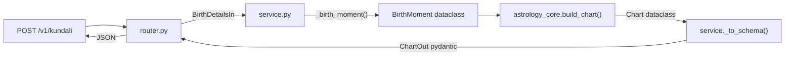
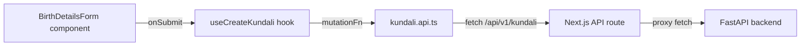

# 🏗️ Nakhatra — Complete Refactoring Guide

> **Goal**: Clean architecture with mirrored feature folders, zero logic in UI, proper separation of concerns across frontend and backend.

---

## Engineering Standards (apply to every phase)

These are the rules each phase is checked against. They are ranked by payoff — the top block
is non-negotiable, the bottom block is where "best practice" turns into cargo cult.

### Backend

| Standard | What it means here | Status |
|---|---|---|
| **Layering** | `router.py` → `service.py` → `repository.py`. Routers never touch the DB. Services never import FastAPI or raise `HTTPException` — they raise domain errors the router maps. | Phases 1-5 |
| **Pure core** | `astrology_core/` imports no framework and nothing from `app.modules` / `app.core`. Enforced by `uv run lint-imports`. | Already holds — keep it |
| **argon2id** | Replaces the hand-rolled PBKDF2 with a timestamp salt. See Step 1.0. | Phase 1 |
| **PyJWT** | Replaces hand-rolled JWT encode/decode. See Step 1.0. | Phase 1 |
| **SQLModel** | `CLAUDE.md` says SQLModel; the code is raw SQL strings over a hand-rolled `DBWrapper`. Reconcile it — this also unblocks Alembic autogenerate. | **Phase 9** |
| **Session injection** | `get_db()` returns a module-level global connection shared across threads (`core/db.py:60-83`). psycopg2 connections are not thread-safe. Inject a per-request session instead. | Phase 9 |
| **Auth on every write** | `Depends(get_current_user)` on every route that costs money or touches user data. Chat, report and TTS all call paid APIs. | Phases 3-5 |
| **One error envelope** | Services raise `AppError` subclasses from `core/errors.py`. Routers contain **no** `try` / `except` / `HTTPException` — `install_error_handlers` already maps them to `{"error": {"code", "message", "details"}}`. A second error shape breaks every client that switches on `code`. | Phases 1-5 |
| **Typed settings** | Everything through `core/config.py`. Never `os.getenv` at a call site, never rely on the SDK reading `ANTHROPIC_BASE_URL` from the environment. Secrets have **no default** — an absent `JWT_SECRET` must refuse to boot, not fall back to a committed string. | All |
| **Tests as the contract** | Golden charts in `tests/astrology/fixtures/` are a contract (CLAUDE.md rule 4). Any port of calculation logic pins its output as a fixture *before* the port. | Phase 4, 9 |

### Frontend

| Standard | What it means here | Status |
|---|---|---|
| **TanStack Query owns server state** | Every `fetch` goes through a `hooks/use-*.ts` wrapping `useQuery`/`useMutation`. No `useState` holding server data, no `useEffect` fetching. | Phase 7 |
| **Zustand owns UI state only** | Drawer open, selected tab, active voice. If the server is the source of truth, it does not belong in a store. Two copies of the same data is the bug this rule prevents. | Phase 7 |
| **Zod validates input, not output** | Zod schemas cover **user form input**. API *responses* are typed from `contracts/openapi.json` via `npm run generate:api` — never hand-write a response type, never re-validate the server's own contract at runtime. | Phase 7 |
| **react-hook-form + zodResolver** | One resolver per form. Keeps validation declarative and out of the component. | Phase 7 |
| **Dumb components** | Components receive props and render. No `fetch`, no calculations, no prompt strings. Event handlers call hooks. | Phase 7 |
| **Contract check per feature** | Every `types.ts` re-exports from `generated/schema` *and* asserts the request body still matches the endpoint (`_CreateBody extends X ? true : never`). Nothing outside `types.ts` imports `generated/`. Turns a renamed field into a build error. | Phase 7 |
| **One error class** | Every `api/*.api.ts` throws `ApiError` from `lib/api/errors.ts` — never `new Error(body.error)`, which stringifies the envelope object to `[object Object]`. Components switch on `err.code`, never on `err.message`. | Phase 7 |
| **Feature isolation** | Features never import each other. Shared UI goes to `components/ui/` only at the second real consumer — not the first. | Phase 7 |
| **Server Components by default** | `"use client"` only where interactivity actually starts, pushed as far down the tree as it will go. | Phase 7 |

### Where "best practice" becomes cargo cult

Say no to these, deliberately:

- **Interfaces / ABCs with one implementation.** A `UserRepositoryProtocol` with exactly one
  `SqlUserRepository` behind it is indirection, not Dependency Inversion. Add the protocol
  when the second implementation shows up, and not before.
- **A `models.py` domain layer that mirrors `schemas.py` field-for-field.** The template
  lists `models.py` as optional. Keep it optional. Two identical classes and a mapper
  between them is not Clean Architecture, it is typing practice.
- **Repository methods for queries nobody makes.** Write `find_by_email` because login needs
  it. Do not write `find_all`, `find_by_created_after`, `count` on spec.
- **A Zustand store per feature by reflex.** `features/report/store/report-store.ts` holding
  one `activeSection` string is a `useState` with extra files. Add the store when the state
  is genuinely shared across sibling components.
- **Wrapping TanStack Query in your own hook layer.** `useKundaliQuery` calling
  `useCustomQuery` calling `useQuery` is three names for one thing.
- **DTO ↔ entity mappers on the frontend.** The generated OpenAPI types *are* the contract.

> **The SOLID test that actually applies here:** can `service.py` be imported and called from
> a plain pytest without FastAPI, without a running DB, and without a network? If yes, the
> layering is real. If it needs a `TestClient`, it is not. Everything else is decoration.

---

## 📐 Canonical Folder Structures

### Frontend Feature Template (Reference: `features/kundali/`)

Every frontend feature **MUST** follow this exact structure:

```
features/{feature-name}/
├── api/                    # HTTP client functions (fetch calls to backend)
│   └── {feature}.api.ts    # Named exports: createX(), fetchX(), updateX()
├── components/             # Pure UI components (ZERO business logic)
│   ├── {component}.tsx     # Dumb components — receive props, render JSX
│   └── inputs/             # Optional: form input sub-components
├── hooks/                  # React hooks (TanStack Query mutations/queries)
│   └── use-{action}.ts     # Wraps api/ calls with useMutation/useQuery
├── schema/                 # Zod validation schemas (form inputs only)
│   └── {schema}.ts         # z.object({...}), export inferred type
├── store/                  # Zustand stores (client-only UI state)
│   └── {feature}-store.ts  # create()(set => ({...})) — NOT server state
└── types.ts                # Re-exports from generated OpenAPI schema
```

> [!NOTE]
> **Enforced as of 2026-09-06.** All nine web features now carry the full set —
> `api/`, `components/`, `hooks/`, `schema/`, `store/`, `types.ts` — whether or not
> they have anything to put in them yet. Empty directories hold a `.gitkeep`,
> because git does not track a directory, only files: without it the mirror
> survives on one machine and vanishes on clone.
>
> Three files were sitting at a feature root and moved into place:
> `auth/auth-modal.tsx` and `auth/session-sync.tsx` → `auth/components/`,
> `report/section-icon.tsx` → `report/components/`. `chat/message.ts` folded into
> `chat/types.ts`, so `types.ts` is again the only file allowed at a feature root.
>
> A `types.ts` in a feature with no endpoints yet exports nothing and says so, with
> a pointer to `features/kundali/types.ts` as the pattern to follow once it has one.
>
> **`home/` was merged into `marketing/`.** They were the same domain: the
> `(marketing)` route group was being served by two features, with `/` importing from
> `home` and `/privacy` and `/terms` importing from `marketing`. 7.6 created `home/`
> as a new feature; that was a mistake. Eight features now, not nine.
>
> `generating-screen.tsx` went to `kundali/components/` in the same pass — it is the
> "calculating your chart" screen used by `/generating` in the `(app)` group, and had
> nothing to do with marketing beyond having been filed there.

#### Rules

| Layer | What goes here | What NEVER goes here |
|-------|---------------|---------------------|
| `api/` | `fetch()` calls, request/response mapping | Business logic, calculations, LLM prompts |
| `components/` | JSX, Tailwind, event handlers that call hooks | `fetch()`, `useState` for server data, calculations |
| `hooks/` | `useMutation`, `useQuery`, analytics tracking | Raw `fetch()`, direct API calls |
| `schema/` | Zod schemas for **user input** validation | API response validation (server owns that) |
| `store/` | UI-only state (drawer open, selected tab) | Server state (use TanStack Query instead) |
| `types.ts` | Type aliases from `lib/api/generated/schema` | Inline type definitions |

### Backend Module Template (Reference: `modules/places/`)

Every backend module **MUST** follow this exact structure:

```
modules/{feature}/
├── __init__.py         # Module exports
├── router.py           # FastAPI route definitions ONLY
│                       #   → Receives HTTP request
│                       #   → Validates via Pydantic schema
│                       #   → Calls service function
│                       #   → Returns HTTP response
├── service.py          # Business logic (NO FastAPI, NO SQL)
│                       #   → Receives typed args from router
│                       #   → Orchestrates repository + domain logic
│                       #   → Returns Pydantic schema objects
├── repository.py       # Database access ONLY (raw SQL / ORM)
│                       #   → Receives simple args (id, email)
│                       #   → Executes SQL queries
│                       #   → Returns raw rows or None
├── schemas.py          # Pydantic models (In/Out DTOs)
│                       #   → Request validation schemas
│                       #   → Response serialization schemas
└── models.py           # Domain models (optional, for complex features)
                        #   → Pure Python dataclasses
                        #   → No framework imports
```

#### Rules

| Layer | What goes here | What NEVER goes here |
|-------|---------------|---------------------|
| `router.py` | Route decorators, dependency injection, HTTP error mapping | SQL queries, business logic, LLM calls |
| `service.py` | Business logic, orchestration, data transformation | `@router`, `HTTPException`, raw SQL |
| `repository.py` | SQL queries, `conn.execute()`, data access | Business rules, HTTP concepts, Pydantic models |
| `schemas.py` | Pydantic `BaseModel` for request/response | SQL, business logic |
| `models.py` | `@dataclass` domain objects | FastAPI, Pydantic, SQL |

---

## Reference Implementation: How the Kundali Feature Works Today

> [!NOTE]
> Both reference implementations were re-audited. The backend module and the frontend
> feature are genuinely worth copying — but each has a defect that would propagate into all
> ten phases if copied blind. Both are listed after the call chains. Copy the patterns, not
> the files.

### Backend Call Chain (✅ Clean — use as template)



[router.py](file:///Users/bibektimilsina/projects/kundali/apps/api/src/app/modules/kundali/router.py) → [service.py](file:///Users/bibektimilsina/projects/kundali/apps/api/src/app/modules/kundali/service.py) → `astrology_core` → back

### Frontend Call Chain (✅ Clean — use as template)



[birth-details-form.tsx](file:///Users/bibektimilsina/projects/kundali/apps/web/src/features/kundali/components/birth-details-form.tsx) → [use-create-kundali.ts](file:///Users/bibektimilsina/projects/kundali/apps/web/src/features/kundali/hooks/use-create-kundali.ts) → [kundali.api.ts](file:///Users/bibektimilsina/projects/kundali/apps/web/src/features/kundali/api/kundali.api.ts) → API route → FastAPI

### What to copy from the reference — and what not to

**Backend `modules/kundali/` — copy these three things:**

1. **Explicit wire schemas, never `dataclass.to_dict()`.** `schemas.py` says why in its
   docstring: this file generates `contracts/openapi.json`, so if the response shape were an
   accident of an internal dataclass, every internal refactor would be a breaking API change.
2. **Validation at the trust boundary, with the reason in the code.** The `tz_name`
   validator (`schemas.py:42-56`) rejects `+05:45` and explains that an offset silently
   corrupts historical charts. That is the single highest-value validator in the API.
3. **Documented nullability.** `dignity: str | None` carries "Null for Rahu and Ketu —
   classical sources disagree, so the engine declines to invent one. Clients must render the
   absence." Every nullable field in every new module gets a sentence like that, or clients
   guess.

**Frontend `features/kundali/` — copy the compile-time contract check:**

```typescript
// types.ts — every feature gets this, not just kundali
type _CreateBody =
  paths["/v1/kundali"]["post"]["requestBody"]["content"]["application/json"];
const _check: _CreateBody extends BirthDetailsIn ? true : never = true;
void _check;
```

Three lines that turn "the API renamed a field" from a runtime 422 into a build failure.
Combined with the rule that **nothing outside `types.ts` imports from `generated/`**, a
contract change ripples through one file per feature instead of the whole app.

**Two defects in the references — fix before copying:**

| Where | Defect | Fix |
|---|---|---|
| `features/kundali/api/kundali.api.ts:26` | `throw new Error(errorData.error \|\| ...)`. The envelope is `{error: {code, message, details}}`, so `errorData.error` is an **object** and the thrown message is `[object Object]`. Meanwhile the hook already types its error as `ApiError`. | Use the existing `lib/api/errors.ts`: `throw new ApiError(res.status, await res.json().catch(() => undefined))`. Do this before Phase 7 copies the file five times. |
| `features/kundali/api/` | Contains `astrologer-prompt.ts`, `chart-ai-context.ts`, `report-generator.ts`, `fallback-chart.ts` — prompts, formatters and mock data, none of them HTTP clients. The reference feature violates the template it is the reference for. | `api/` holds `fetch` wrappers only. Those four files move to the backend or get deleted (Phase 8.5). |

---

## Phase 0: Backend — `integrations/llm.py`

> [!NOTE]
> **Status: done.** `uv add anthropic`, `src/app/integrations/llm.py`, plus a third
> import-linter contract — *integrations do not depend on modules* — so an integration can
> never reach back into a module "just for a schema". 3 contracts kept.
>
> **Correction to the snippet below.** `effort` is not a key inside `thinking`. Per
> `docs/ai-astrologer.md` they are two separate parameters:
> `thinking={"type": "adaptive"}` and `output_config={"effort": "medium"}`. Passing
> `thinking={"type": "adaptive", "effort": "medium"}` — as the first draft of this guide
> said — is wrong. Both are exported from `llm.py` as `THINKING` and `OUTPUT_CONFIG` so
> callers cannot get it wrong twice.


Phases 3 and 4 both call the LLM. `CLAUDE.md` requires **every client construction** to live
in one file, so build it before either of them.

```bash
cd apps/api && uv add anthropic
```

```python
"""The one place an LLM client is constructed. Nothing else instantiates Anthropic()."""

from __future__ import annotations

from functools import lru_cache

from anthropic import AsyncAnthropic

from app.core.config import get_settings

LLM_MODEL = "claude-opus-5"          # bare model id — AgentRouter routes it


@lru_cache(maxsize=1)
def get_client() -> AsyncAnthropic:
    s = get_settings()
    if not s.LLM_API_KEY or not s.LLM_BASE_URL:
        raise RuntimeError("LLM_API_KEY / LLM_BASE_URL not configured")
    # Both passed explicitly: the SDK silently reads ANTHROPIC_BASE_URL from the
    # environment otherwise, which sends an AgentRouter key to api.anthropic.com
    # and fails as a 401 that looks exactly like a bad key.
    return AsyncAnthropic(api_key=s.LLM_API_KEY, base_url=s.LLM_BASE_URL)
```

> [!NOTE]
> `LLM_BASE_URL`, `LLM_API_KEY` and `LLM_MODEL` already exist in `core/config.py:30-32`,
> already pointed at AgentRouter with `claude-opus-5`. Read them; do not redeclare them.

`integrations/` sits beside `modules/` and `astrology_core/`. It may import `core.config`;
it must not import `app.modules` — the dependency runs the other way.

---

## Phase 1: Backend — Fix Auth Module

> [!NOTE]
> **Status: done.** Implemented 2026-09-06. `229 passed, 1 failed` (the failure is the
> deliberate Phase 0 astrology gate in `test_golden.py`, unchanged from baseline).
> Files: `hashing.py`, `jwt_handler.py`, `repository.py`, `service.py`, `router_deps.py`,
> `router.py`, `schemas.py`, `core/config.py`, `tests/conftest.py`,
> `tests/modules/test_auth_hashing.py`.
>
> **Three deviations from the text below, all deliberate:**
>
> 1. **Duplicate signup stays `400`, not `409`,** and signup stays `200`, not `201`. Both
>    are more correct as written, and both are client-visible changes that buy nothing.
>    Rule 7 applies to status codes as much as to fields.
> 2. **The error envelope did change** for `/v1/auth/*`, from FastAPI's `{"detail": ...}` to
>    the shared `{"error": {code, message, details}}`. That is technically client-visible,
>    but it is a fix: `apps/mobile/lib/core/network/api_client.dart:59` already parses the
>    envelope, so auth errors were unparseable on mobile. `auth-context.tsx` and
>    `kundali.api.ts` were updated to throw `ApiError` in the same pass.
> 3. **`password` min_length 6 → 8** narrows an input constraint, normally a rule 7
>    violation. Verified safe: `apps/mobile/lib/features/` contains only `kundali`, so the
>    web client we control is the sole caller. Tighten while that is still true.
>
> Two things were found during implementation and fixed:
>
> - `make contract` was `... > contracts/openapi.json`. The shell truncates the target
>   *before* the command runs, so any export failure silently emptied the committed spec.
>   Now writes to a temp file and moves it.
> - The committed `contracts/openapi.json` predated the auth, vault and milan modules — 8
>   paths and 16 schemas missing. `make contract-check` was already failing in CI. Regenerated;
>   the diff is purely additive.
> - The test suite read and wrote the developer's real `data/kundali_vault.sqlite3`, so tests
>   were order-dependent and destructive on a machine with real data. `tests/conftest.py` now
>   redirects `core.db.DB_PATH` to a temp directory.


### Current State (❌ Anemic)
[auth/router.py](file:///Users/bibektimilsina/projects/kundali/apps/api/src/app/modules/auth/router.py) has raw SQL in route handlers. No `service.py` or `repository.py`.

### Target Structure
```
modules/auth/
├── __init__.py         ← exists
├── hashing.py          ← CREATE: argon2 (replaces hash/verify in jwt_handler.py)
├── jwt_handler.py      ← REFACTOR: PyJWT, delete the hand-rolled crypto
├── router_deps.py      ← CREATE: get_current_user (see Step 1.4)
├── router.py           ← REFACTOR: remove all SQL
├── service.py          ← CREATE: business logic
├── repository.py       ← CREATE: all SQL queries
└── schemas.py          ← REFACTOR: password min_length, created_at, expires_in (Step 1.0c)
```

### Step 1.0: Fix `jwt_handler.py` — it is **not** safe to keep as-is

Three real defects in the current file:

| Line | Defect | Severity |
|------|--------|----------|
| `jwt_handler.py:17` | `salt = sha256(str(time.time_ns()))[:16]` — the salt is derived from the **signup timestamp**, not `secrets`. It is guessable, which is most of what a salt exists to prevent. | **High** |
| `jwt_handler.py:47-49` | `_b64_url_decode` calls `urlsafe_b64**encode**`. It is currently dead code, which is the only reason nothing is broken. | Landmine |
| whole file | Hand-rolled JWT encode/decode. The signature check is actually correct (`compare_digest`, `exp` verified), but this is not code worth owning. | Medium |

**Use argon2id.** It is the current password-hashing recommendation, and switching gets you
a proper random salt for free rather than as a separate fix:

```bash
cd apps/api && uv add argon2-cffi pyjwt
```

```python
"""Password hashing. argon2id, with transparent upgrade from the legacy PBKDF2 format."""

from __future__ import annotations

import hashlib
import hmac

from argon2 import PasswordHasher
from argon2.exceptions import VerificationError, VerifyMismatchError

_ph = PasswordHasher()          # argon2id defaults; tune only with a benchmark


def hash_password(password: str) -> str:
    return _ph.hash(password)


def verify_password(plain: str, stored: str) -> bool:
    """True if `plain` matches. Handles both argon2 and legacy `salt:pbkdf2hex` rows."""
    if stored.startswith("$argon2"):
        try:
            return _ph.verify(stored, plain)
        except (VerifyMismatchError, VerificationError):
            return False
    return _verify_legacy(plain, stored)


def needs_rehash(stored: str) -> bool:
    return not stored.startswith("$argon2") or _ph.check_needs_rehash(stored)


def _verify_legacy(plain: str, stored: str) -> bool:
    # ponytail: delete this once no rows start with anything but "$argon2".
    # Query: SELECT count(*) FROM users WHERE password_hash NOT LIKE '$argon2%';
    try:
        salt, key_hex = stored.split(":", 1)
    except ValueError:
        return False
    key = hashlib.pbkdf2_hmac("sha256", plain.encode(), salt.encode(), 100_000)
    return hmac.compare_digest(key, bytes.fromhex(key_hex))
```

> [!CAUTION]
> You cannot rehash existing users in a migration — the plaintext is gone. Rehash **on
> successful login**, in `service.login()`:
> ```python
> if hashing.needs_rehash(row["password_hash"]):
>     repository.update_password_hash(row["id"], hashing.hash_password(body.password))
> ```
> Without this, every existing account keeps its timestamp-salted hash forever.

And replace the hand-rolled JWT with PyJWT — same tokens, no custom crypto:

```python
import jwt   # pyjwt

def create_jwt_token(payload: dict, expires_in_seconds: int = 86400 * 30) -> str:
    return jwt.encode({**payload, "exp": int(time.time()) + expires_in_seconds},
                      get_settings().JWT_SECRET, algorithm="HS256")

def decode_jwt_token(token: str) -> dict | None:
    try:
        return jwt.decode(token, get_settings().JWT_SECRET, algorithms=["HS256"])
    except jwt.PyJWTError:
        return None
```

`algorithms=["HS256"]` as a list is what blocks alg-confusion.

### Step 1.0b: `JWT_SECRET` has a hardcoded default — fix `core/config.py`

```python
JWT_SECRET: str = "kundali-dev-secret-key-change-in-production-2026"   # config.py:35
```

> [!CAUTION]
> This is the most serious issue in the backend. The secret is committed, so **anyone who
> can read this repository can mint a valid token for any `sub`** in any deployment that
> forgot to set the variable — and because it has a default, nothing ever tells you it was
> forgotten. The file's own docstring argues for failing at boot; this line does the
> opposite.

```python
from pydantic import field_validator

class Settings(BaseSettings):
    ...
    JWT_SECRET: str = ""          # no default. Empty means "not configured".
    LLM_API_KEY: str = ""

    @field_validator("JWT_SECRET")
    @classmethod
    def _secret_present(cls, v: str, info) -> str:
        if not v or len(v) < 32:
            raise ValueError(
                "JWT_SECRET must be set to a random value of at least 32 chars "
                "(`openssl rand -hex 32`). Refusing to boot with a weak or absent secret."
            )
        return v
```

Add `JWT_SECRET` to `apps/api/.env.example` with a placeholder and a comment saying to
generate a fresh one — never the real value (rule 10). Rotating it logs everyone out, which
is the correct behaviour and a reason to do it now rather than after launch.

While in this file: `LLM_API_KEY` also defaults to `""` despite the module docstring
promising a boot-time failure. Validate it the same way once Phase 0 lands.

### Step 1.0c: `auth/schemas.py` is **not** "keep as-is"

| Field | Issue | Change |
|---|---|---|
| `password: min_length=6` | Six characters is below every current guideline. | `min_length=8`. Argon2 has no bcrypt-style 72-byte truncation, so `max_length=100` is fine to keep. |
| `UserProfileOut.created_at: str` | Typed `str` because the column is TEXT. Phase 9 turns it into a real timestamp and the type silently changes meaning. | `created_at: datetime`. ISO-8601 serialises identically, so this is not a wire change — safe under rule 7. |
| `TokenResponse` | No expiry field, so the client cannot know when to refresh and only discovers expiry via a 401. | Add `expires_in: int` (seconds). Additive, so old clients ignore it. |

> [!WARNING]
> `/v1/auth/login` has no rate limiting. Once the API is public that is an unthrottled
> password-guessing endpoint. `slowapi` is the small option (one decorator, in-memory
> buckets); a fixed window at the reverse proxy is the zero-dependency option. Either is
> fine — none is not.

### Step 1.1: Create `auth/repository.py`

```python
"""Data access for users table. No business logic, no HTTP concepts."""

from __future__ import annotations
from typing import Any

from app.core.db import get_db


def find_by_email(email: str) -> Any | None:
    """Return user row or None."""
    conn = get_db()
    return conn.execute(
        "SELECT id, email, password_hash, full_name, created_at FROM users WHERE email = ?",
        (email.lower(),),
    ).fetchone()


def find_by_id(user_id: str) -> Any | None:
    """Return user row or None."""
    conn = get_db()
    return conn.execute(
        "SELECT id, email, full_name, created_at FROM users WHERE id = ?",
        (user_id,),
    ).fetchone()


def create(user_id: str, email: str, password_hash: str, full_name: str, created_at: str) -> None:
    """Insert a new user."""
    conn = get_db()
    with conn:
        conn.execute(
            """
            INSERT INTO users (id, email, password_hash, full_name, created_at)
            VALUES (?, ?, ?, ?, ?)
            """,
            (user_id, email, password_hash, full_name, created_at),
        )
```

### Step 1.2: Create `auth/service.py`

```python
"""Auth business logic. No FastAPI imports, no raw SQL."""

from __future__ import annotations

import uuid
from datetime import datetime, timezone

from app.modules.auth import repository
from app.modules.auth.jwt_handler import create_jwt_token, hash_password, verify_password
from app.modules.auth.schemas import TokenResponse, UserLoginIn, UserProfileOut, UserSignupIn


def signup(body: UserSignupIn) -> TokenResponse:
    existing = repository.find_by_email(body.email)
    if existing:
        raise EmailAlreadyRegisteredError()

    user_id = f"usr_{uuid.uuid4().hex[:12]}"
    pw_hash = hash_password(body.password)
    now_iso = datetime.now(timezone.utc).isoformat()

    repository.create(user_id, body.email.lower(), pw_hash, body.full_name, now_iso)

    user = UserProfileOut(id=user_id, email=body.email.lower(), full_name=body.full_name, created_at=now_iso)
    token = create_jwt_token({"sub": user_id, "email": body.email.lower()})
    return TokenResponse(access_token=token, user=user)


def login(body: UserLoginIn) -> TokenResponse:
    row = repository.find_by_email(body.email)
    if not row or not verify_password(body.password, row["password_hash"]):
        raise InvalidCredentialsError()

    user = UserProfileOut(id=row["id"], email=row["email"], full_name=row["full_name"], created_at=row["created_at"])
    token = create_jwt_token({"sub": row["id"], "email": row["email"]})
    return TokenResponse(access_token=token, user=user)


def get_profile(user_id: str) -> UserProfileOut:
    row = repository.find_by_id(user_id)
    if not row:
        raise UserNotFoundError()
    return UserProfileOut(id=row["id"], email=row["email"], full_name=row["full_name"], created_at=row["created_at"])


# --- Domain Errors: subclass AppError, do NOT invent a parallel hierarchy ---
class EmailAlreadyRegisteredError(AppError):
    status_code = 409
    code = "email_taken"
    def __init__(self) -> None:
        super().__init__("That email is already registered.")


class InvalidCredentialsError(AppError):
    status_code = 401
    code = "invalid_credentials"
    def __init__(self) -> None:
        super().__init__("Invalid email or password.")


class UserNotFoundError(NotFoundError):
    code = "user_not_found"
    def __init__(self) -> None:
        super().__init__("User not found.")
```

> [!CAUTION]
> **Do not write `class EmailAlreadyRegisteredError(Exception)`.** `core/errors.py` already
> defines `AppError` / `ValidationError` / `NotFoundError` and `main.py:53` already installs
> handlers for them. Bare `Exception` subclasses bypass that: they surface as an unhandled
> 500, or — if you catch them in the router and raise `HTTPException` — they serialise as
> FastAPI's `{"detail": "..."}` instead of the `{"error": {"code", "message", "details"}}`
> envelope that `lib/api/errors.ts` and the Flutter client both parse. Two error shapes in
> one API is exactly the breakage rule 7 exists to prevent.

Add the import at the top of `service.py`:

```python
from app.core.errors import AppError, NotFoundError
```

`InvalidCredentialsError` deliberately does not say *which* of email or password was wrong —
that difference is a user-enumeration oracle.

### Step 1.3: Refactor `auth/router.py` (thin wrapper)

```python
"""FastAPI Auth endpoints. Routes ONLY — no SQL, no business logic, no try/except."""

from __future__ import annotations

from fastapi import APIRouter, Depends

from app.modules.auth import service
from app.modules.auth.router_deps import get_current_user
from app.modules.auth.schemas import TokenResponse, UserLoginIn, UserProfileOut, UserSignupIn

router = APIRouter(prefix="/v1/auth", tags=["auth"])


@router.post("/signup", response_model=TokenResponse, status_code=201)
def signup(body: UserSignupIn) -> TokenResponse:
    return service.signup(body)


@router.post("/login", response_model=TokenResponse)
def login(body: UserLoginIn) -> TokenResponse:
    return service.login(body)


@router.get("/me", response_model=UserProfileOut)
def me(user_id: str = Depends(get_current_user)) -> UserProfileOut:
    return service.get_profile(user_id)
```

> [!TIP]
> Notice there is no `try` / `except` / `HTTPException` anywhere. The handler installed by
> `install_error_handlers(app)` turns any `AppError` into the right status and the right
> envelope. A router that catches its own service's exceptions is doing the error layer's
> job twice — and every `except` you delete is a status code that can no longer drift
> between two modules.
>
> This is the "thin router" the whole guide is aiming at. Nine lines of body for three
> endpoints, against the 120 in the current file.

> [!IMPORTANT]
> **Step 1.4 — do this as part of Phase 1, not later.** `get_current_user` currently lives
> in `auth/router.py`. Move it to `auth/router_deps.py` so vault, chat, report and tts can
> import it without a circular dependency on `auth/router.py`. Phases 3-5 all assume this
> file exists; skipping it here means redoing their imports.

---

## Phase 2: Backend — Fix Vault Module

> [!NOTE]
> **Status: done.** Implemented 2026-09-06. `237 passed, 1 failed` (the failure is the same
> deliberate astrology gate). `router.py` went 231 → 72 lines. Files: `repository.py`,
> `service.py`, `router.py`, `schemas.py`, `core/db.py`, `tests/modules/test_vault.py`.
>
> **Step 2.5 verified, not just written.** `test_saved_kundali_round_trips_into_birth_details`
> saves a kundali, reads back `birth`, and posts it straight to `/v1/kundali` expecting a 200.
> That is the claim the step is making, so it is the thing worth asserting.
>
> **Deviations, all deliberate:**
>
> 1. **`birth` is derived on read, not stored.** The draft implied a new column. Deriving it
>    from the flat columns keeps one source of truth — a stored copy is a second one, and it
>    drifts. A row with no `tz_name` returns `birth: null` rather than a zone guessed from
>    `tz_offset`; a guessed zone produces a chart that looks right and is wrong by minutes of
>    arc (rule 5).
> 2. **The N+1 was deleted rather than optimised.** The draft suggested a single
>    `WHERE session_id IN (...)`. Simpler: the session *list* now returns `messages: []`
>    always, and messages load when a session is opened. Verified no client reads them —
>    nothing in `apps/web` calls `/v1/vault/sessions` yet. The field stays in the response
>    (rule 7); only its contents changed, and it is documented in the schema.
> 3. **`lat`/`lon` gained `ge`/`le` bounds**, matching `kundali.BirthDetailsIn`. A narrowing,
>    but no legitimate client sends a latitude of 91, and the vault previously accepted
>    coordinates the chart endpoint would reject.
> 4. **Indexes from 8.2 landed here**, not in Phase 8 — they are all vault tables and the same
>    file was already open.
>
> **One thing the guide missed entirely.** `CREATE TABLE IF NOT EXISTS` does not add a column
> to a database that already exists, so `tz_name` would have been present on a fresh checkout
> and absent in production — the failure mode being a 500 on the first `SELECT`. `core/db.py`
> now carries `_add_missing_columns()`, an `_ADDED_COLUMNS` tuple checked against
> `PRAGMA table_info` / `information_schema`. It is marked `ponytail:` and Phase 8's Alembic
> baseline replaces it.
>
> **Contract re-verified as additive:** no removed paths, no removed properties, no
> newly-required fields.


### Current State (❌ Anemic)
[vault/router.py](file:///Users/bibektimilsina/projects/kundali/apps/api/src/app/modules/vault/router.py) — 232 lines of inline SQL across 7 endpoints.

### Target Structure
```
modules/vault/
├── __init__.py
├── router.py           ← REFACTOR: thin wrapper only
├── service.py          ← CREATE: orchestration logic
├── repository.py       ← CREATE: all SQL for kundalis, sessions, messages
└── schemas.py          ← UPDATE: add tz_name field
```

### Step 2.1: Create `vault/repository.py`

Extract ALL SQL from `router.py` into named functions:

```python
"""Data access for saved_kundalis, chat_sessions, chat_messages tables."""

from __future__ import annotations
from typing import Any

from app.core.db import get_db


# --- Saved Kundalis ---

def list_kundalis(user_id: str) -> list[Any]:
    conn = get_db()
    return conn.execute(
        "SELECT * FROM saved_kundalis WHERE user_id = ? ORDER BY created_at DESC",
        (user_id,),
    ).fetchall()


def create_kundali(kundali_id: str, user_id: str, **fields) -> None:
    conn = get_db()
    with conn:
        conn.execute(
            """INSERT INTO saved_kundalis
            (id, user_id, name, gender, dob, tob, lat, lon, tz_name, tz_offset, place_name, created_at)
            VALUES (?, ?, ?, ?, ?, ?, ?, ?, ?, ?, ?, ?)""",
            (kundali_id, user_id, fields["name"], fields["gender"], fields["dob"],
             fields["tob"], fields["lat"], fields["lon"], fields["tz_name"],
             fields["tz_offset"], fields["place_name"], fields["created_at"]),
        )


def delete_kundali(kundali_id: str, user_id: str) -> int:
    conn = get_db()
    with conn:
        res = conn.execute("DELETE FROM saved_kundalis WHERE id = ? AND user_id = ?", (kundali_id, user_id))
        return res.rowcount


# --- Chat Sessions ---

def list_sessions(user_id: str) -> list[Any]:
    conn = get_db()
    return conn.execute(
        "SELECT * FROM chat_sessions WHERE user_id = ? ORDER BY updated_at DESC",
        (user_id,),
    ).fetchall()


def find_session(session_id: str, user_id: str) -> Any | None:
    conn = get_db()
    return conn.execute(
        "SELECT * FROM chat_sessions WHERE id = ? AND user_id = ?",
        (session_id, user_id),
    ).fetchone()


def create_session(session_id: str, user_id: str, kundali_id: str | None, title: str, now: str) -> None:
    conn = get_db()
    with conn:
        conn.execute(
            "INSERT INTO chat_sessions (id, user_id, kundali_id, title, created_at, updated_at) VALUES (?, ?, ?, ?, ?, ?)",
            (session_id, user_id, kundali_id, title, now, now),
        )


def delete_session(session_id: str, user_id: str) -> int:
    conn = get_db()
    with conn:
        res = conn.execute("DELETE FROM chat_sessions WHERE id = ? AND user_id = ?", (session_id, user_id))
        return res.rowcount


# --- Chat Messages ---

def list_messages(session_id: str) -> list[Any]:
    conn = get_db()
    return conn.execute(
        "SELECT * FROM chat_messages WHERE session_id = ? ORDER BY created_at ASC",
        (session_id,),
    ).fetchall()


def create_message(msg_id: str, session_id: str, sender: str, content: str, now: str) -> None:
    conn = get_db()
    with conn:
        conn.execute(
            "INSERT INTO chat_messages (id, session_id, sender, content, created_at) VALUES (?, ?, ?, ?, ?)",
            (msg_id, session_id, sender, content, now),
        )
        conn.execute("UPDATE chat_sessions SET updated_at = ? WHERE id = ?", (now, session_id))
```

### Step 2.2: Create `vault/service.py`

```python
"""Vault business logic. Orchestrates repository calls and schema mapping."""

from __future__ import annotations

import uuid
from datetime import datetime, timezone

from app.modules.vault import repository
from app.modules.vault.schemas import (
    ChatMessageIn, ChatMessageOut, ChatSessionIn, ChatSessionOut,
    SavedKundaliIn, SavedKundaliOut,
)


def list_kundalis(user_id: str) -> list[SavedKundaliOut]:
    rows = repository.list_kundalis(user_id)
    return [SavedKundaliOut(**dict(r)) for r in rows]


def save_kundali(body: SavedKundaliIn, user_id: str) -> SavedKundaliOut:
    kundali_id = f"knd_{uuid.uuid4().hex[:12]}"
    now_iso = datetime.now(timezone.utc).isoformat()
    repository.create_kundali(kundali_id, user_id, **body.model_dump(), created_at=now_iso)
    return SavedKundaliOut(id=kundali_id, user_id=user_id, created_at=now_iso, **body.model_dump())


def delete_kundali(kundali_id: str, user_id: str) -> None:
    if repository.delete_kundali(kundali_id, user_id) == 0:
        raise KundaliNotFoundError()


def list_sessions(user_id: str) -> list[ChatSessionOut]:
    rows = repository.list_sessions(user_id)
    result = []
    for r in rows:
        msgs = repository.list_messages(r["id"])
        result.append(ChatSessionOut(
            id=r["id"], user_id=r["user_id"], kundali_id=r["kundali_id"],
            title=r["title"], created_at=r["created_at"], updated_at=r["updated_at"],
            messages=[ChatMessageOut(**dict(m)) for m in msgs],
        ))
    return result


def create_session(body: ChatSessionIn, user_id: str) -> ChatSessionOut:
    session_id = f"ses_{uuid.uuid4().hex[:12]}"
    now_iso = datetime.now(timezone.utc).isoformat()
    repository.create_session(session_id, user_id, body.kundali_id, body.title, now_iso)
    return ChatSessionOut(
        id=session_id, user_id=user_id, kundali_id=body.kundali_id,
        title=body.title, created_at=now_iso, updated_at=now_iso, messages=[],
    )


def add_message(session_id: str, body: ChatMessageIn, user_id: str) -> ChatMessageOut:
    if not repository.find_session(session_id, user_id):
        raise SessionNotFoundError()
    msg_id = f"msg_{uuid.uuid4().hex[:12]}"
    now_iso = datetime.now(timezone.utc).isoformat()
    repository.create_message(msg_id, session_id, body.sender, body.content, now_iso)
    return ChatMessageOut(id=msg_id, session_id=session_id, sender=body.sender, content=body.content, created_at=now_iso)


def delete_session(session_id: str, user_id: str) -> None:
    if repository.delete_session(session_id, user_id) == 0:
        raise SessionNotFoundError()


# --- Domain Errors: same rule as auth — subclass core.errors ---
class KundaliNotFoundError(NotFoundError):
    code = "kundali_not_found"
    def __init__(self) -> None:
        super().__init__("Saved kundali not found.")


class SessionNotFoundError(NotFoundError):
    code = "session_not_found"
    def __init__(self) -> None:
        super().__init__("Chat session not found.")
```

> [!NOTE]
> Both are `NotFoundError` (404) even when the row exists but belongs to another user. Every
> repository query in this module is scoped `WHERE id = ? AND user_id = ?`, so "not yours"
> and "not there" are indistinguishable to the caller. That is intentional — a 403 would
> confirm the id exists.

### Step 2.3: Refactor `vault/router.py` to thin wrapper

Replace the 231 lines with roughly 50 that call `service.*` and nothing else — **no
try/except, no `HTTPException`**, same as Step 1.3. Every handler is one line:

```python
@router.get("/kundalis", response_model=list[SavedKundaliOut])
def list_kundalis(user_id: str = Depends(get_current_user)) -> list[SavedKundaliOut]:
    return service.list_kundalis(user_id)
```

> [!WARNING]
> `service.list_sessions()` as drafted in Step 2.2 runs one `list_messages()` query **per
> session** — a classic N+1. With 40 saved sessions that is 41 round trips on one page load.
> Either fetch messages in a single `WHERE session_id IN (...)` query and group in Python, or
> drop `messages` from the list response entirely and load them when a session is opened.
>
> Dropping them is the smaller change and the better API: a session list does not need every
> message body. But `messages` is already in the response today, so removing it is a
> **breaking** change under rule 7 — keep the field, return `[]` in the list endpoint, and
> populate it only in the single-session endpoint. Document that in the field description.

### Step 2.4: Add `tz_name` to `vault/schemas.py` — **additively**

```python
class SavedKundaliIn(BaseModel):
    name: str = Field(..., min_length=1, max_length=100)
    gender: str = Field("male", pattern="^(male|female)$")
    dob: str = Field(..., pattern=r"^\d{4}-\d{2}-\d{2}$")
    tob: str = Field(..., pattern=r"^\d{2}:\d{2}(:\d{2})?$")
    lat: float
    lon: float
    tz_name: str | None = None    # ← ADD as OPTIONAL. IANA name, e.g. "Asia/Kathmandu"
    tz_offset: float = 0.0        # ← keep. Deprecated, but old clients still send only this
    place_name: str
```

> [!CAUTION]
> Do **not** make `tz_name` required (`Field(..., min_length=1)`). That is a newly-required
> request field, which CLAUDE.md rule 7 forbids: `apps/mobile` has shipped builds that post
> without it, and App Store users stay on old builds for months. A required field 422s every
> one of them.

Service-layer handling, so both old and new clients work:

```python
def _resolve_tz(body: SavedKundaliIn) -> str:
    """Prefer the IANA name; fall back to the offset only for legacy clients."""
    if body.tz_name:
        return body.tz_name
    # ponytail: reverse-geocoding lat/lon → IANA is the real fix; a stored offset is
    # already wrong for historical dates (Kathmandu: +5:41:16 → +5:30 → +5:45 in 1986).
    # Flag the row so it can be backfilled rather than silently trusting the offset.
    return ""
```

New writes should always carry `tz_name`. Rows with an empty `tz_name` are legacy and need a
backfill — never assert a historical offset from memory, read it from `zoneinfo`
(CLAUDE.md rule 5).

### Step 2.5: The API has two incompatible shapes for the same birth data

This is the design flaw underneath the `tz_name` bug, and worth fixing while you are here:

| | `kundali.BirthDetailsIn` | `vault.SavedKundaliIn` |
|---|---|---|
| date | `date: date` | `dob: str` |
| time | `time: str` | `tob: str` |
| zone | `tz_name` (IANA, **validated**) | `tz_offset: float` (unvalidated) |
| latitude | `latitude` (`ge=-90, le=90`) | `lat` (unbounded) |
| longitude | `longitude` (`ge=-180, le=180`) | `lon` (unbounded) |
| place | `place_label` | `place_name` |
| accuracy | `time_accuracy` | absent |

A chart saved through `/v1/vault/kundalis` therefore **cannot be fed back into
`/v1/kundali`** without a translation layer, and every client has written its own. The
saved copy also loses the validation that makes the chart correct in the first place — an
out-of-range latitude or a bogus zone is accepted on save and only explodes on recalculation.

**Fix, additively:** add a `birth: BirthDetailsIn | None` field to `SavedKundaliIn` /
`SavedKundaliOut`, populate it on write, and keep the seven flat legacy fields populated on
read for old clients.

```python
class SavedKundaliOut(BaseModel):
    id: str
    user_id: str
    birth: BirthDetailsIn | None = None   # ← the real shape. New clients read this.
    # --- legacy flat fields, still written for old mobile builds. Do not remove. ---
    dob: str
    tob: str
    lat: float
    ...
```

New clients read `birth`; old builds keep reading the flat fields; nothing breaks (rule 7).
Once analytics show no old builds calling the endpoint, the flat fields can go — that is a
`/v2` decision, not this refactor's.

> [!TIP]
> `gender: str = Field(pattern="^(male\|female)^")` is a two-value string. Vedic matching
> rules need it, but the pattern makes it non-extensible and clients must already treat
> unknown enum values as "other" (`main.py:19-22`). Leave it — this is a note for whoever
> adds a third value, not work for now.

## Phase 3: Backend — Create Chat Module (NEW)

> [!NOTE]
> **Status: done.** Implemented 2026-09-06. `251 passed, 1 failed` (the usual gate).
> `modules/chat/{schemas,prompts,service,router}.py`, registered in `main.py`, and
> `app/api/v1/chat/route.ts` reduced 116 → 30 lines. 14 new tests, no network.
>
> **Deviations:**
>
> 1. **`chart` and `birth` are typed (`ChartOut`, `BirthDetailsIn`), not `dict`.** A
>    malformed chart now fails at the boundary instead of producing a confidently wrong
>    reading. See the contract note below — this had a consequence.
> 2. **The response is snake_case** (`astrological_basis`, `highlight_house`), matching the
>    rest of the API. The four web call sites were updated. The UI's own `Message` type keeps
>    its camelCase field — that is an internal type, not the wire.
> 3. **The system prompt is two cache blocks**, not one string: stable instructions carrying
>    `cache_control`, then the chart. `docs/ai-astrologer.md` calls caching "the whole cost
>    model", and a prompt with the seeker's name in the prefix caches for exactly one person.
>    A test asserts the name is *not* in the static block.
> 4. **The old dynamic fallback is gone.** The previous route, on any AI failure, returned a
>    fabricated sentence about the user's ascendant as though it were a reading. That is the
>    failure mode CLAUDE.md rule 1 exists to prevent. It now returns a 503 with
>    `astrologer_unavailable`.
> 5. **`buildAstrologerRealtimePrompt` was NOT ported.** `api/v1/realtime-session/route.ts`
>    still imports it, so `astrologer-prompt.ts` cannot be deleted until Phase 5 (already
>    noted in 8.5).
>
> **The contract trap this phase walks into.** Using `ChartOut` as both a request field and a
> response body makes FastAPI emit `ChartOut-Input` / `ChartOut-Output` and **delete
> `ChartOut`** — renaming the schema both clients generate from. `features/kundali/types.ts`
> stopped compiling immediately. Fixed with `separate_input_output_schemas=False` on the app;
> the distinction is one neither client makes. Re-verified additive afterwards.
>
> **Not done, deliberately:** streaming, and the tool-use design in `docs/ai-astrologer.md`
> (five chart tools, `modules/conversations` owning storage). Phase 3 is a faithful lift of
> the endpoint that exists, not a build-out of the endpoint that is designed. The doc's
> `@pytest.mark.live` proxy checks — caching, tool use, streaming survive AgentRouter — are
> still worth running before building further on top.


### Why
All chat/LLM logic currently lives in [apps/web/src/app/api/v1/chat/route.ts](file:///Users/bibektimilsina/projects/kundali/apps/web/src/app/api/v1/chat/route.ts) (Next.js). This must move to FastAPI.

### Target Structure
```
modules/chat/
├── __init__.py
├── router.py           # POST /v1/chat
├── service.py          # LLM orchestration, prompt building, response parsing
├── prompts.py          # System prompt templates (moved from frontend)
├── schemas.py          # ChatRequest, ChatResponse
└── models.py           # Domain models if needed
```

### Step 3.1: Create `chat/schemas.py`

```python
"""Chat API wire formats."""

from __future__ import annotations
from pydantic import BaseModel, Field


class ChatRequest(BaseModel):
    query: str = Field(..., min_length=1)
    messages: list[dict] = Field(default_factory=list)
    chart: dict        # ChartOut payload
    birth: dict        # BirthDetailsIn payload
    language: str = Field("en", pattern="^(en|ne|hi)$")


class ChatResponse(BaseModel):
    text: str
    astrological_basis: str
    highlight_house: int | None = None
```

### Step 3.2: Create `chat/prompts.py`

Move the entire contents of [astrologer-prompt.ts](file:///Users/bibektimilsina/projects/kundali/apps/web/src/features/kundali/api/astrologer-prompt.ts) and [chart-ai-context.ts](file:///Users/bibektimilsina/projects/kundali/apps/web/src/features/kundali/api/chart-ai-context.ts) to Python:

```python
"""Astrologer AI system prompt builders. Moved from frontend TypeScript."""

def build_astrologer_system_prompt(chart: dict, birth: dict, language: str = "en") -> str:
    """Build the Master Astrologer system prompt with chart context."""
    user_name = birth.get("name", "Seeker")
    chart_context = format_chart_for_ai(chart, birth)
    # ... (translate the full TypeScript prompt template to Python)
    return f"""You are KUNDALI.AI's Master Astrologer...
{chart_context}
..."""


def format_chart_for_ai(chart: dict, birth: dict) -> str:
    """Format complete sidereal chart into structured text for AI models."""
    # ... (translate formatCompleteChartForAI from chart-ai-context.ts)
    pass
```

### Step 3.3: Create `chat/service.py`

> [!IMPORTANT]
> Read the **LLM** section of `CLAUDE.md` before writing this file. The model is
> `claude-opus-5` served through AgentRouter on the Anthropic wire protocol. Concretely:
> the official `anthropic` SDK, `system` as a **top-level parameter** (not a message),
> **no `temperature`** and **no assistant prefill** (both 400 on this model), and
> `stop_reason == "refusal"` checked before reading `content`. An OpenAI-shaped
> `/chat/completions` call with `temperature: 0.7` — as an earlier draft of this guide
> suggested — fails against every one of those.

```python
"""Chat business logic. Orchestrates the LLM call. No FastAPI, no SQL."""

from __future__ import annotations

import json

from app.integrations.llm import get_client, LLM_MODEL
from app.modules.chat.prompts import build_astrologer_system_prompt
from app.modules.chat.schemas import ChatRequest, ChatResponse


async def generate_response(req: ChatRequest) -> ChatResponse:
    system_prompt = build_astrologer_system_prompt(req.chart, req.birth, req.language)

    history = [
        {"role": "assistant" if m.get("sender") != "user" else "user",
         "content": m.get("text", "")}
        for m in req.messages[-6:]
    ]

    resp = await get_client().messages.create(
        model=LLM_MODEL,
        max_tokens=1800,
        system=system_prompt,                      # top-level, NOT a message
        messages=[*history, {"role": "user", "content": req.query}],
        thinking=THINKING,               # {"type": "adaptive"}
        output_config=OUTPUT_CONFIG,     # {"effort": "medium"} — a SEPARATE param
    )

    if resp.stop_reason == "refusal":
        return ChatResponse(text="I cannot answer that.", astrological_basis="")

    raw = resp.content[0].text
    try:
        parsed = json.loads(raw[raw.index("{"):raw.rindex("}") + 1])
        return ChatResponse(
            text=parsed.get("text", raw),
            astrological_basis=parsed.get("astrologicalBasis", ""),
            highlight_house=parsed.get("highlightHouse"),
        )
    except (json.JSONDecodeError, ValueError):
        return ChatResponse(text=raw, astrological_basis="Vedic Reading")
```

> [!TIP]
> Prompt caching breaks on any per-request variance in the system prompt. Keep
> `datetime.now()`, request ids and user names out of `build_astrologer_system_prompt`, and
> serialise the chart snapshot with `sort_keys=True`.

### Step 3.4: Create `chat/router.py`

```python
"""Chat API endpoint."""

from fastapi import APIRouter, Depends

from app.modules.auth.router_deps import get_current_user
from app.modules.chat import service
from app.modules.chat.schemas import ChatRequest, ChatResponse

router = APIRouter(prefix="/v1", tags=["chat"])


@router.post("/chat", response_model=ChatResponse)
async def chat(body: ChatRequest, user_id: str = Depends(get_current_user)) -> ChatResponse:
    return await service.generate_response(body)
```

> [!WARNING]
> The `Depends(get_current_user)` is not optional. Today this endpoint is only reachable
> through a Next.js route with the key held server-side. On FastAPI it is a public URL — an
> unauthenticated LLM endpoint is an open proxy that anyone can bill to your AgentRouter
> account. Same applies to `/v1/report` and `/v1/tts`.

### Step 3.5: Register in `main.py`

```python
from app.modules.chat.router import router as chat_router
app.include_router(chat_router)
```

### Step 3.6: Simplify Frontend `app/api/v1/chat/route.ts`

Replace the entire 117-line file with a thin proxy:

```typescript
import { NextResponse } from "next/server";

const FASTAPI_URL = process.env.FASTAPI_URL || "http://127.0.0.1:8000";

export async function POST(req: Request) {
  const body = await req.json();
  const res = await fetch(`${FASTAPI_URL}/v1/chat`, {
    method: "POST",
    headers: { "Content-Type": "application/json" },
    body: JSON.stringify(body),
  });
  const data = await res.json();
  return NextResponse.json(data, { status: res.status });
}
```

---

## Phase 4: Backend — Create Report Module (NEW)

> [!NOTE]
> **Status: done.** Implemented 2026-09-06. `280 passed, 1 failed` (the usual gate); web
> 16 tests. `modules/report/{schemas,generator,prompts,service,router}.py`;
> `app/api/v1/report/route.ts` 103 → 29 lines.
>
> **Step 0 paid for itself immediately.** Fixtures were captured by running the *original
> TypeScript* over three real charts (Kathmandu, London, Reykjavik) in all three languages —
> nine reports, `tests/modules/report_fixtures/`. The Python port is asserted equal to them,
> so all 440 lines of trilingual prose are verified rather than eyeballed.
>
> **It caught a real bug class.** JavaScript `toFixed` rounds half away from zero; Python's
> `format` rounds half to even. On `0.125` they disagree (`0.13` vs `0.12`) — a printed
> ascendant degree that changes depending on which language rendered it. `generator._fixed`
> uses `Decimal` + `ROUND_HALF_UP` to match. The expectations in that test were checked
> against `node -e "v.toFixed(2)"` rather than assumed; the first guesses were wrong.
>
> **Deviations:**
>
> 1. **The generator is data-driven**, not a line-by-line transcription of the nested
>    ternaries: one template table per language, one context dict. Same output, a third of
>    the size, and adding a language is a table rather than a fourth ternary branch.
> 2. **A malformed model report now falls back**, where the original accepted anything with
>    5+ array elements. Sections missing `content` or `reasoning` rendered as broken cards;
>    the rule engine's seven are always well-formed and strictly better.
> 3. **`source` is `"llm"` / `"rule_engine"`**, not `"agent_router_ai"` /
>    `"dynamic_astronomy_engine"`. The old names leak the vendor into the wire contract; if
>    the router changes, the field lies. Nothing consumed it.
>
> **The duplication this phase does NOT remove.** `reading-dashboard.tsx` renders a report
> instantly from the TypeScript generator while the API call completes, so
> `report-generator.ts` cannot be deleted here — 8.5 was wrong to schedule it for Phase 4.
> Two copies of 440 lines of trilingual prose is exactly the drift risk this guide exists to
> prevent, so both are now pinned to the **same fixture file**:
> `test_report_generator.py` and `report-generator.test.ts` each assert 9 reports against
> `report_fixtures/`. Editing either copy alone fails a test. Phase 7 replaces the instant
> render with a loading state and deletes the TypeScript.
>
> Before this phase the component's initial state was `MOCK_REPORT_SECTIONS` — a stranger's
> hardcoded reading shown to every user for a beat. Still there; Phase 7 removes it with the
> mock data file (8.5).


### Why
Report generation lives in [apps/web/src/app/api/v1/report/route.ts](file:///Users/bibektimilsina/projects/kundali/apps/web/src/app/api/v1/report/route.ts) and [report-generator.ts](file:///Users/bibektimilsina/projects/kundali/apps/web/src/features/kundali/api/report-generator.ts) (441 lines of frontend logic).

### Target Structure
```
modules/report/
├── __init__.py
├── router.py           # POST /v1/report
├── service.py          # LLM call + fallback rule engine
├── prompts.py          # Report generation prompt template
├── generator.py        # Deterministic fallback report generator
│                       # (moved from report-generator.ts → Python)
└── schemas.py          # ReportRequest, ReportSection, ReportResponse
```

### Steps

> [!IMPORTANT]
> **Step 0, before writing any Python:** pin the current output. Call the existing
> `/api/v1/report` route with 3-5 saved charts, save the responses as fixtures under
> `apps/api/tests/modules/report/fixtures/`, and assert the Python port reproduces them.
> Porting 441 lines of scoring rules by hand without this is how readings silently change
> and nobody notices for a month.

1. Create `report/schemas.py` with `ReportRequest`, `ReportSection`, `ReportResponse`
2. Translate `report-generator.ts` (441 lines) → `report/generator.py` (pure Python, no
   framework imports) and run it against the fixtures from step 0
3. Create `report/prompts.py` — extract the system/user prompts from `route.ts`
4. Create `report/service.py` — LLM first via `integrations/llm.py` (Phase 0), fall back to
   `generator.py`. Same rules as chat: no `temperature`, check `stop_reason`.
5. Create `report/router.py` — `POST /v1/report` with `Depends(get_current_user)`
6. Register in `main.py`, then `make contract` and regenerate both clients
7. Simplify `apps/web/src/app/api/v1/report/route.ts` to a thin proxy

## Phase 5: Backend — Voice Modules (TTS, transcribe, realtime)

> [!NOTE]
> **Status: done.** Implemented 2026-09-06 at the user's request, ahead of the mobile need
> this phase was deferred for. Backend `314 passed, 1 failed` (the usual gate), 26 of them
> new; web 27 tests, `next build` passes, contract additive.
>
> One `modules/voice/` rather than the three the draft implied — they share the cache, the
> OpenAI client and the language mapping, and splitting them would have been three modules
> importing each other.
>
> **Verified against a real server**, not just mocked: synthesis actually ran (the fallback
> engine returned a genuine 18KB MPEG layer III file), the second identical request came back
> `cached: true`, and `GET /v1/tts/audio/{name}` served it as `audio/mpeg`.
>
> ### The three problems this phase had to solve
>
> 1. **Cache ownership.** The old cache wrote into `apps/web/public/audio-cache/` and returned
>    a path Next served statically — which works only while Next is the only client, and 404s
>    for anyone else. The API owns it now and serves it at `GET /v1/tts/audio/{name}`, with a
>    thin Next route streaming the bytes through.
> 2. **That endpoint cannot be authenticated.** An `<audio src>` sends no Authorization
>    header. It is safe because the filename is a SHA-256 of voice + language + text, so it is
>    unguessable, and `cache.path_for` accepts only names matching the pattern this service
>    generates. Both are tested, including traversal attempts.
> 3. **Multipart does not fit the JSON proxy.** `/v1/transcribe` gets its own route that
>    streams `req.body` with `duplex: "half"` and the original `Content-Type`, because reading
>    the body as text destroys the audio part.
>
> ### Deviations
>
> - **`OPENAI_API_KEY` is gone from the web app entirely** — it now appears only in a comment.
>   That completes 8.3.
> - **`astrologer-prompt.ts` and `chart-ai-context.ts` are deleted.** `buildAstrologerRealtimePrompt`
>   was the last thing keeping them, and it is now `voice/prompts.py`. `features/kundali/api/`
>   finally contains only API clients, which is what the template says it is for.
> - **Voices are a `Literal`, not a validated-then-substituted string.** The old code silently
>   swapped an unknown voice for a default; a typo in a client now 422s instead of producing
>   audio in the wrong voice.
> - **`to_spoken` collapses whitespace runs.** The TypeScript left double spaces behind every
>   substitution ("27 degrees  exactly"); harmless to a synthesiser, but `spoken_text` is
>   displayed as a teleprompter, where it reads as a typo.
> - **A missing key is a graceful fallback, not an error.** `/v1/realtime-session` returns
>   `fallback: "media_recorder_whisper"` with a 200 so the client records and transcribes
>   instead of losing voice mode. `/v1/tts` falls through to the free engine the same way.
> - **A 25MB upload cap** on transcription. Whisper bills by the minute, and past ten minutes
>   it is not a question.


### Why
[apps/web/src/app/api/v1/tts/route.ts](file:///Users/bibektimilsina/projects/kundali/apps/web/src/app/api/v1/tts/route.ts) (188 lines) contains text processing, OpenAI TTS API calls, Google TTS fallback, and disk caching — all in a Next.js API route.

### Target Structure
```
modules/tts/
├── __init__.py
├── router.py           # POST /v1/tts
├── service.py          # TTS orchestration (OpenAI → Google fallback)
├── text_processor.py   # Markdown stripping, sentence splitting, degree symbols
├── cache.py            # Disk cache read/write (SHA256 keyed)
└── schemas.py          # TTSRequest, TTSResponse
```

### Steps

1. Translate `splitTextIntoSentences()` and the markdown stripping → `text_processor.py`
2. **Decide where the audio cache lives before writing `cache.py`.** Today the route writes
   into `apps/web/public/audio-cache/` and returns `/audio-cache/<sha>.mp3`, which only
   works because Next serves that directory. FastAPI writing to it changes nothing on the
   web side; the URL 404s. Either leave caching in Next, or have FastAPI serve the files
   (`StaticFiles`) or S3 and return an absolute URL.
3. Move the OpenAI TTS call + Google fallback → `service.py`. Needs `uv add httpx` (httpx is
   currently a **dev-only** dependency) and `OPENAI_API_KEY` in `apps/api/.env`.
4. Create a thin `router.py` with `Depends(get_current_user)` — TTS costs money per call.
5. Port `/v1/transcribe` (multipart, Whisper) and `/v1/realtime-session` (mints an OpenAI
   realtime `client_secret`) in the same phase, or voice mode is half-migrated and both
   `OPENAI_API_KEY` and `astrologer-prompt.ts` have to stay in the frontend anyway.
6. Only then simplify the frontend routes.

## Phase 6: Remove child_process Hacks from Frontend

> [!NOTE]
> **Status: done.** Implemented 2026-09-06. Eight routes now total **73 lines** against 645
> before. `grep -r child_process apps/web/src` returns nothing. `scripts/calc_chart.py`,
> `run_auth.py` and `run_milan.py` deleted. Backend `280 passed, 1 failed`; web 23 tests.
>
> ### The bug this phase uncovered
>
> `api/v1/kundali/route.ts` rebuilt the request body field by field before forwarding it —
> and the rebuilt object had no `name`. `BirthDetailsIn` requires `name`, so **FastAPI
> answered 422 on every single chart request**, `res.ok` was false, and the route fell
> through to `execFile`. Every chart in the product was being computed by spawning a Python
> subprocess; the FastAPI path had never once succeeded.
>
> Deleting the fallback first, as this phase originally described, would have taken chart
> generation down completely. Verified before and after: the exact proxy payload returns 422,
> the same payload plus `name` returns 200, and a real `uvicorn` now serves the web client's
> body directly.
>
> That is the argument for **passing the body through as text**. A proxy that re-parses and
> re-serialises is a place where a field can go missing, and the failure is silent because
> the fallback hides it.
>
> The same route also defaulted a missing latitude/longitude to Kathmandu. A chart for the
> wrong city renders perfectly and is entirely wrong (rule 5). The API rejecting it is
> correct; the default is gone.
>
> ### Deviations
>
> 1. **One shared `lib/api/proxy.ts`**, not the template copied into eight files. Auth
>    forwarding, the error envelope, and "upstream detail never reaches the client" must be
>    identical everywhere; eight copies is eight chances to diverge. Each route is now 5 lines.
> 2. **A non-JSON upstream response is not forwarded.** A gateway's HTML error page is not the
>    error envelope clients parse, so it becomes a `bad_gateway` envelope instead.
> 3. **`proxy.test.ts` pins the three rules** — body passed through byte for byte (with an
>    unknown field, the regression that started this), token forwarded, and `ECONNREFUSED`
>    with an internal IP never reaching the browser.
>
> Still on the old shape: `tts`, `transcribe` and `realtime-session`. They hold
> `OPENAI_API_KEY` and are not JSON-in/JSON-out — Phase 5, deferred.


### Files to fix

Referenced by symbol, not line number — line numbers rot on the first edit.

| File | Action |
|------|--------|
| `api/v1/kundali/route.ts` | Delete the `child_process` / `execFile` fallback branch. Keep only the FastAPI proxy. |
| `api/v1/milan/match/route.ts` | Delete the block that writes a Python script to disk and `execFile`s it. Keep only the FastAPI proxy. |
| `api/v1/auth/login/route.ts` | Simplify to thin proxy. |
| `api/v1/auth/signup/route.ts` | Simplify to thin proxy. |
| `api/v1/auth/me/route.ts` | Simplify to thin proxy (forward `Authorization`). |
| `api/v1/vault/kundalis/route.ts` | Simplify to thin proxy (forward `Authorization`). |
| `api/v1/chat/route.ts` | Simplify to thin proxy — **after** Phase 3. |
| `api/v1/report/route.ts` | Simplify to thin proxy — **after** Phase 4. |
| `api/v1/tts/route.ts` | Phase 5. Read the cache-ownership note in the template below first. |
| `api/v1/transcribe/route.ts` | Phase 5. Multipart — the JSON template does not apply. |
| `api/v1/realtime-session/route.ts` | Phase 5. Holds `OPENAI_API_KEY`, mints a WebRTC `client_secret`, and imports `buildAstrologerRealtimePrompt` from the frontend. Needs its own backend module; it is not a proxy. |

> [!NOTE]
> The original draft of this guide listed neither `transcribe` nor `realtime-session`, while
> Phase 8.3 claimed all keys move to the backend. Both hold `OPENAI_API_KEY`. They are the
> reason Phase 5 is bigger than "one TTS module".

### Thin Proxy Template

For **JSON in, JSON out** routes (chat, report, kundali, milan, auth, vault):

```typescript
import { NextResponse } from "next/server";

const API_URL = process.env.FASTAPI_URL || "http://127.0.0.1:8000";

export async function POST(req: Request) {
  try {
    const auth = req.headers.get("authorization");
    const res = await fetch(`${API_URL}/v1/{endpoint}`, {
      method: "POST",
      headers: {
        "Content-Type": "application/json",
        ...(auth ? { Authorization: auth } : {}),
      },
      body: await req.text(),          // pass through, no re-serialisation
    });
    return NextResponse.json(await res.json(), { status: res.status });
  } catch (err) {
    console.error("proxy /v1/{endpoint} failed", err);        // detail stays server-side
    return NextResponse.json({ error: "Service unavailable" }, { status: 502 });
  }
}
```

> [!WARNING]
> Never put `err.message` or the upstream body in the client response. Birth data and
> internal paths end up in browser consoles and analytics (CLAUDE.md rule 9). Log it, return
> a generic message.

**This template does not fit every route.** Two exceptions, both in Phase 5:

| Route | Why the template breaks | What to do instead |
|-------|------------------------|--------------------|
| `/api/v1/transcribe` | Request is `multipart/form-data` with an audio `File`. `await req.text()` destroys it. | Stream the body through: forward `req.body` with `duplex: "half"` and copy the original `Content-Type`, or keep the route in Next. |
| `/api/v1/tts` | Response is JSON, but it points at `/audio-cache/<sha>.mp3` written into `apps/web/public/` and served by Next's static handler (`tts/route.ts:8,96-97`). A FastAPI `cache.py` writes to a directory Next does not serve → every cached URL 404s. | Decide the cache owner **before** writing `cache.py`: leave the cache web-side, or have FastAPI serve `/audio-cache` itself (or S3) and return an absolute URL. |

## Phase 7: Frontend — Decompose MVP Monolith

### Current State
```
features/mvp/                      ← 3,400+ lines, GOD COMPONENTS
├── components/
│   ├── live-mode-workspace.tsx     ← 1,682 lines 🔴
│   ├── reading-dashboard.tsx       ← 1,339 lines 🔴
│   ├── homepage-hero.tsx           ←   386 lines
│   ├── chat-message-bubble.tsx     ←   142 lines
│   ├── custom-voice-selector.tsx   ←   212 lines
│   └── generating-screen.tsx       ←   125 lines
├── data/mock-data.ts               ←   212 lines 🔴 DELETE
└── types.ts                        ←    28 lines
```

### Target State — New Feature Modules

```
features/
├── kundali/           ← EXISTS (✅ reference pattern)
├── auth/              ← EXISTS (needs api/, hooks/, schema/, store/, types.ts)
├── chat/              ← NEW (extracted from live-mode-workspace + reading-dashboard)
├── voice/             ← NEW (extracted from live-mode-workspace)
├── report/            ← NEW (extracted from reading-dashboard)
├── milan/             ← NEEDS: api/, hooks/, schema/, types.ts
└── marketing/         ← landing, legal, and the homepage hero
```

### 7.1: Create `features/auth/` (Complete)

> [!NOTE]
> **Status: done.** Implemented 2026-09-06. `auth-context.tsx` (218 lines) deleted; all five
> consumers migrated. `tsc` clean, `next build` passes, 27 web tests. New files lint clean.
>
> **The context was four concerns in one file**, and only one of them belonged together:
>
> | Concern | Was | Now |
> |---|---|---|
> | Session identity | `useState` + manual `localStorage` | `store/auth-store.ts` (Zustand, `persist`) |
> | Auth modal state | `useState` in the same provider | same store, `partialize`d out of persistence |
> | login / signup / logout | hand-rolled `async` functions | `hooks/use-auth.ts` (TanStack mutations) |
> | **Saved kundali list** | **`useState<SavedKundali[]>`** | **`features/vault/` — `useQuery`** |
>
> That last row is the one that mattered. A server-owned list in `useState` meant every
> caller adding a kundali had to remember to splice the array by hand — the hand-written
> cache invalidation rule 6 exists to prevent. It is now a query key and an
> `invalidateQueries`.
>
> **`features/vault/` is a new feature this guide did not plan.** The saved-kundali list is
> vault data, not auth data; filing it under `features/auth/` because that is where the code
> happened to live would have carried the original mistake forward.
>
> **Two things found while migrating:**
>
> 1. **`saveKundaliToVault` had no callers.** The context exposed it, nothing used it — the
>    "save to vault" path is not wired into any UI. `useSaveKundali` exists for when it is.
> 2. **An expired token was never detected.** The context restored `token` and `user` from
>    `localStorage` and trusted both forever, so a dead session produced silent 401s on every
>    request with no way back except clearing site data. `useSessionSync` now validates once
>    against `/v1/auth/me` and clears the session on a 401 — and *only* on a 401, because
>    signing a user out because the backend returned 502 is worse than letting them retry.
>
> **Deviations:**
>
> - **`useLogout` clears the whole query cache.** Without it the next person to sign in on a
>   shared device sees the previous user's vault until each query refetches.
> - **Zod validates in the two form components**, not via `react-hook-form` + `zodResolver` as
>   8.4 suggests. Both forms already manage their own `useState` fields; adding a form library
>   to two working forms is a bigger change than the validation it buys. The schemas are in
>   place, so adopting the resolver later is local to those components.
> - **The token is still persisted to `localStorage`** — same as before. Moving it to an
>   httpOnly cookie is a session-behaviour change that does not belong inside a refactor.
>   Marked `ponytail:` in the store.


```
features/auth/
├── api/
│   └── auth.api.ts         # login(), signup(), fetchMe() — extract from auth-context.tsx
├── components/
│   ├── auth-modal.tsx       # ← MOVE from current location (already exists)
│   └── login-page.tsx       # ← MOVE from app/(app)/login/page.tsx
├── hooks/
│   ├── use-login.ts         # useMutation wrapping auth.api.login()
│   ├── use-signup.ts        # useMutation wrapping auth.api.signup()
│   └── use-auth.ts          # useQuery wrapping auth.api.fetchMe()
├── schema/
│   └── auth-forms.ts        # Zod: loginSchema, signupSchema
├── store/
│   └── auth-store.ts        # Zustand: token, user profile (replaces Context)
└── types.ts                 # Re-export: UserProfileOut, TokenResponse from generated schema
```

### Step-by-step for `features/auth/`:

**Step 7.1.1**: Create `auth/types.ts`
```typescript
import type { components } from "@/lib/api/generated/schema";

export type UserProfile = components["schemas"]["UserProfileOut"];
export type TokenResponse = components["schemas"]["TokenResponse"];
```

**Step 7.1.2**: Create `auth/schema/auth-forms.ts`
```typescript
import { z } from "zod";

export const loginSchema = z.object({
  email: z.string().email("Invalid email"),
  password: z.string().min(6, "Password must be at least 6 characters"),
});

export const signupSchema = z.object({
  full_name: z.string().trim().min(1, "Name is required"),
  email: z.string().email("Invalid email"),
  password: z.string().min(6, "Password must be at least 6 characters"),
});

export type LoginForm = z.infer<typeof loginSchema>;
export type SignupForm = z.infer<typeof signupSchema>;
```

**Step 7.1.3**: Create `auth/api/auth.api.ts`
```typescript
import type { TokenResponse, UserProfile } from "../types";

export async function login(email: string, password: string): Promise<TokenResponse> {
  const res = await fetch("/api/v1/auth/login", {
    method: "POST",
    headers: { "Content-Type": "application/json" },
    body: JSON.stringify({ email, password }),
  });
  if (!res.ok) throw new Error((await res.json()).detail || "Login failed");
  return res.json();
}

export async function signup(full_name: string, email: string, password: string): Promise<TokenResponse> {
  const res = await fetch("/api/v1/auth/signup", {
    method: "POST",
    headers: { "Content-Type": "application/json" },
    body: JSON.stringify({ full_name, email, password }),
  });
  if (!res.ok) throw new Error((await res.json()).detail || "Signup failed");
  return res.json();
}

export async function fetchMe(token: string): Promise<UserProfile> {
  const res = await fetch("/api/v1/auth/me", {
    headers: { Authorization: `Bearer ${token}` },
  });
  if (!res.ok) throw new Error("Session expired");
  return res.json();
}
```

**Step 7.1.4**: Create `auth/store/auth-store.ts` (Zustand replacing Context)
```typescript
import { create } from "zustand";
import { persist } from "zustand/middleware";
import type { UserProfile } from "../types";

interface AuthState {
  token: string | null;
  user: UserProfile | null;
  setAuth: (token: string, user: UserProfile) => void;
  clearAuth: () => void;
}

export const useAuthStore = create<AuthState>()(
  persist(
    (set) => ({
      token: null,
      user: null,
      setAuth: (token, user) => set({ token, user }),
      clearAuth: () => set({ token: null, user: null }),
    }),
    { name: "kundali-auth" },
  ),
);
    { name: "kundali-auth" },
  ),
);
```

> [!WARNING]
> `persist` writes the JWT to `localStorage`. See Phase 8.4 — ship it this way to match
> current behaviour, then move the token out of persisted state.

**Step 7.1.5**: Create `auth/hooks/use-login.ts`
```typescript
"use client";
import { useMutation } from "@tanstack/react-query";
import * as authApi from "../api/auth.api";
import { useAuthStore } from "../store/auth-store";
import { identifyUser, trackEvent } from "@/providers/posthog-provider";

export function useLogin() {
  const setAuth = useAuthStore((s) => s.setAuth);
  return useMutation({
    mutationFn: ({ email, password }: { email: string; password: string }) =>
      authApi.login(email, password),
    onSuccess: (data) => {
      setAuth(data.access_token, data.user);
      identifyUser(data.user.id, { email: data.user.email, name: data.user.full_name });
      trackEvent("user_signed_in", { method: "email" });
    },
  });
}
```

### 7.2-7.6: chat, report, milan, home — **done** (data layers)

> [!NOTE]
> **Status: partial — deliberately.** Implemented 2026-09-06. `tsc` clean, `next build`
> passes, 27 web tests. Every new file lints clean.
>
> **What landed:** `features/{chat,report,milan,home,vault}/` with `types.ts` (each carrying
> the compile-time contract check), `api/`, `hooks/`, and `schema/` where there is user input.
> Both god components now call hooks instead of `fetch`. `homepage-hero.tsx` and
> `generating-screen.tsx` moved to `features/kundali/components/` — it is a chart
> concern, not a marketing one.
>
> **What did not:** the JSX. `live-mode-workspace.tsx` (1,688) and `reading-dashboard.tsx`
> (1,340) are still in `features/mvp/`, so 7.7 (`rm -rf features/mvp/`) is not done.
>
> Splitting the *data layer* out is the part that changes the architecture: nothing outside
> `features/*/api/` calls `fetch`, nothing outside `types.ts` touches `generated/`, and
> server state is TanStack Query everywhere. Splitting the *JSX* is mechanical, high-churn,
> and impossible to verify without running the UI — a separate, honest piece of work rather
> than something to rush at the end of a batch.
>
> ### Three bugs the typed hooks exposed
>
> Typing a call site is a test that runs at build time. Each of these was invisible while the
> payload was an untyped object literal:
>
> 1. **Milan hardcoded `tz_name: "Asia/Kathmandu"` for every saved kundali.** Matching a
>    partner born in London used a Nepali timezone — several degrees of ascendant off, in a
>    result that looked entirely normal. This is CLAUDE.md rule 5 exactly. Fixed by
>    `placeFromSavedKundali`, which reads the `birth.tz_name` added in Phase 2 Step 2.5 and
>    returns null for legacy rows so the user picks the birthplace instead of the app guessing.
> 2. **The chat sent `chart: null`** when no chart was loaded. The backend rejected it and the
>    failure vanished into a generic catch. Now guarded with a message that says what is wrong.
> 3. **The milan page hand-wrote a `MilanResult` interface** duplicating the contract, and it
>    had already drifted (`cancellation_reason?: string` where the API says `string | null`).
>    Deleted; the page uses `MilanResponse` from the generated schema (rule 8).
>
> ### Deviations
>
> - **`useReport` is a `useQuery`, not a mutation.** Same chart and language produce the same
>   report, so remounting the dashboard reads the cache instead of paying for the model again.
>   It replaced a `useEffect` + `fetch` + `useState` triple that re-requested on every mount.
> - **No analytics in `useAskAstrologer`.** The caller already emits `ai_chat_message_sent` on
>   submit, which counts failed sends too; tracking success in the hook as well would double
>   every message in the funnel.
> - **`features/vault/`** holds the saved-kundali queries (see 7.1).

### 7.2: Create `features/chat/`

```
features/chat/
├── api/
│   └── chat.api.ts          # sendMessage() — fetch POST /api/v1/chat
├── components/
│   ├── chat-panel.tsx        # Chat container (messages list + input)
│   ├── chat-message.tsx      # ← MOVE chat-message-bubble.tsx here
│   └── chat-input.tsx        # Text input + send button
├── hooks/
│   └── use-send-message.ts   # useMutation wrapping chat.api.sendMessage()
├── schema/
│   └── chat-input.ts         # Zod: z.object({ query: z.string().min(1) })
├── store/
│   └── chat-store.ts         # Zustand: messages[], highlightedHouse, isThinking
└── types.ts                  # ChatMessage, ChatResponse types
```

**Extract from**: Lines handling chat in `live-mode-workspace.tsx` and `reading-dashboard.tsx`

### 7.3: Create `features/voice/`  — defer with Phase 5

```
features/voice/
├── api/
│   ├── tts.api.ts            # speakText() — POST /api/v1/tts
│   ├── transcribe.api.ts     # POST /api/v1/transcribe (multipart)
│   └── realtime.api.ts       # POST /api/v1/realtime-session → client_secret
├── components/
│   ├── voice-workspace.tsx    # Main voice UI (teleprompter, waveform)
│   ├── voice-selector.tsx     # ← MOVE custom-voice-selector.tsx
│   └── mic-visualizer.tsx     # Audio waveform visualization
├── hooks/
│   ├── use-voice-activity.ts  # VAD: Web Audio API frequency analysis
│   ├── use-webrtc.ts          # WebRTC connection lifecycle
│   ├── use-microphone.ts      # Mic permissions, MediaStream
│   └── use-tts.ts             # useMutation for TTS
├── store/
│   └── voice-store.ts         # Zustand: voiceState, selectedVoice, interimTranscript
└── types.ts                   # VoiceState, TranscriptChunk types
```

**Extract from**: the WebRTC / VAD / mic / audio half of `live-mode-workspace.tsx`.

> [!IMPORTANT]
> This extraction does **not** require Phase 5. Point `api/` at the existing Next.js routes
> (`/api/v1/tts`, `/api/v1/transcribe`, `/api/v1/realtime-session`) and change only the URLs
> later. Splitting a 1,681-line component is valuable on its own; coupling it to a risky
> backend port means neither ships.

### 7.4: Create `features/report/`

```
features/report/
├── api/
│   └── report.api.ts          # generateReport() — fetch POST /api/v1/report
├── components/
│   ├── report-dashboard.tsx    # Main report view with sections
│   ├── report-section.tsx      # Individual report section card
│   ├── report-toolbar.tsx      # PDF export, share, audio buttons
│   └── chart-panel.tsx         # Chart display (D1/D9 toggle)
├── hooks/
│   └── use-generate-report.ts  # useMutation wrapping report.api
├── schema/                     # (none needed — no user form input)
├── store/
│   └── report-store.ts         # Zustand: activeSection, chartStyle
└── types.ts                    # ReportSection, ReportResponse types
```

**Extract from**: The 1,339-line `reading-dashboard.tsx`

### 7.5: Create `features/milan/` (Complete)

```
features/milan/
├── api/
│   └── milan.api.ts            # calculateMatch() — fetch POST /api/v1/milan/match
├── components/
│   └── milan-page.tsx          # ← EXTRACT from app/(app)/milan/page.tsx (529 lines!)
├── hooks/
│   └── use-calculate-match.ts  # useMutation wrapping milan.api
├── schema/
│   └── milan-form.ts           # Zod: groom/bride birth details validation
├── store/
│   └── milan-store.ts          # Zustand: matchResult, selectedGroom/Bride
└── types.ts                    # MilanRequest, MilanResponse, KutaResult types
```

### 7.6: ~~Create `features/home/`~~ — superseded

> [!WARNING]
> Do not do this. `home/` and `marketing/` are the same domain; creating both split
> one route group across two features. Merged back on 2026-09-06 — see the note in
> *Canonical Folder Structures*.

#### Original text

```
features/home/
├── components/
│   ├── homepage-hero.tsx       # ← MOVE from mvp/components/
│   └── generating-screen.tsx   # ← MOVE from mvp/components/
└── types.ts
```

### 7.7: Delete `features/mvp/` — **done**

> [!NOTE]
> **Status: done.** 2026-09-06. `features/mvp/` no longer exists; `find src/features` shows
> nine features, all owning their own code. `tsc` clean, `next build` passes, 27 web tests.
>
> | Was | Now |
> |---|---|
> | `mvp/components/reading-dashboard.tsx` | `report/components/` |
> | `mvp/components/live-mode-workspace.tsx` | `voice/components/voice-workspace.tsx` |
> | `mvp/components/custom-voice-selector.tsx` | `voice/components/voice-selector.tsx` |
> | `mvp/components/chat-message-bubble.tsx` | `chat/components/` |
> | `mvp/components/homepage-hero.tsx`, `generating-screen.tsx` | `home/components/` |
> | `mvp/types.ts` → `ReportSection` | deleted; the generated contract owns it |
> | `mvp/types.ts` → `ChatMessage` | `chat/message.ts` (UI shape, distinct from the wire `ChatTurn`) |
> | `mvp/data/mock-data.ts` | deleted in Phase 8 |
>
> **Extracted from the dashboard:** `report-section-card.tsx` (70 lines) and
> `section-icon.tsx`, which replaced a switch statement called from two places with a lookup
> map. The dashboard's `reportSections` **state is gone entirely** — it is now derived
> (`report.data?.report ?? localReport`). Two `useEffect`s wrote to that state with a render
> pass between them; the report is a value, not a lifecycle.
>
> No `useMemo` on the derived value: the React Compiler is enabled here, and a hand-written
> memo it cannot verify makes it bail out of optimising the whole component.

### What is deliberately NOT decomposed further

`voice-workspace.tsx` is still 1,688 lines and `reading-dashboard.tsx` is 1,269. Both are now
pure view code — every `fetch`, prompt, and piece of business logic left in Phases 3-7.

Splitting the remaining JSX further would mean threading 20-30 props per extracted piece
through components that share a lot of state (audio playback, chart selection, WebRTC
lifecycle). Seven components each taking fifteen props is not obviously better than one
component that reads top to bottom, and it cannot be verified without running the UI.

The genuinely valuable remaining work in `voice-workspace.tsx` is **hooks, not components**:
`use-webrtc`, `use-voice-activity`, `use-microphone` (7.3). Those are logic with real
boundaries, unlike the markup around them. They pair naturally with Phase 5, since both
touch the same WebRTC and audio code — do them together, with the app running.


After all extractions are complete:
```bash
rm -rf apps/web/src/features/mvp/
```

---

## Phase 8: Infrastructure Improvements

> [!NOTE]
> **Status: done** except the SQLModel work, which is Phase 9. Implemented 2026-09-06.
> Backend `288 passed, 1 failed` (the usual gate); web 27 tests, `next build` passes.
>
> **8.1 — Alembic, hand-written (Option A).** `migrations/` with a baseline that reproduces
> `init_db()`'s DDL plus the three indexes, applied and verified against a fresh empty
> database. `make migrate` and `make migration M="..."` added.
>
> - `env.py` has **no `target_metadata`**, with the reason in the docstring, so nobody tries
>   `--autogenerate` and ships the empty migration it would produce.
> - `env.py` defines a two-field `_MigrationSettings` instead of importing the app's
>   `Settings`, which would demand a `JWT_SECRET` that migrations neither have nor need. A
>   tool that refuses to run without an unrelated secret is a tool people work around.
> - `downgrade()` on the baseline raises `NotImplementedError`. Downgrading it drops every
>   saved chart and conversation; that is a restore from backup, not a migration.
> - `alembic.ini` carries **no URL** — it is resolved from settings, so the file never holds
>   a credential (rule 10).
> - `init_db()` is deliberately still there. Removing it before the baseline has been stamped
>   on every environment leaves fresh checkouts with no tables. `test_migrations.py` asserts
>   the two describe the same schema, so the duplicate cannot drift while it lasts.
>
> **8.1b — the two deploy footguns.** `create_app()` now refuses to boot when `ENV != local`
> and `CORS_ORIGINS` is empty, and `/health` runs `SELECT 1` and answers 503 when it fails.
> Both are tested, because a guard that never fires is worse than no guard.
>
> **8.2 — indexes** landed in Phase 2 (same tables, same file). **8.4 — Zustand** landed in
> 7.1.
>
> ### 8.5 — what the dead files turned out to be
>
> `fallback-chart.ts` (241 lines) had no importers at all. `mock-data.ts` did, and it was
> worse than "test data":
>
> - **`SAMPLE_BIRTH_DETAILS` was a real person's name and birth date**, committed to the
>   repository and served to every visitor as their own chart. Birth data is sensitive
>   (rule 9), and this was the most exposed possible place for it.
> - Its `time` was `"07:30 PM"`, which `BirthDetailsIn` rejects — so the default chart fetch
>   built on it had been failing validation silently the whole time.
> - `MOCK_REPORT_SECTIONS` was a **different** stranger's finished reading, used as the
>   dashboard's initial state and rendered as the user's own until the real one loaded.
>
> Both files deleted. With no stored kundali the dashboard now redirects to `/kundali`
> instead of fabricating one. `features/mvp/types.ts` also lost its hand-written
> `ReportSection`, which duplicated the generated contract (rule 8).


### 8.1: Database Migrations

> [!WARNING]
> `alembic revision --autogenerate` will **not** work here. `core/db.py` is raw SQL over a
> hand-rolled `DBWrapper` (SQLite + Postgres) — there is no SQLAlchemy `MetaData` to diff
> against, so autogenerate produces an empty migration and silently gives you false
> confidence.

Two honest options:

**Option A — hand-written migrations (recommended, smaller).** Alembic without
autogenerate is still worth it for ordering and `downgrade()`:

```bash
cd apps/api
uv add alembic
uv run alembic init migrations       # point env.py at DATABASE_URL, skip target_metadata
uv run alembic revision -m "baseline"                       # write init_db()'s DDL by hand
uv run alembic revision -m "add_tz_name_to_saved_kundalis"
```

```python
def upgrade():
    op.add_column("saved_kundalis", sa.Column("tz_name", sa.String(64), nullable=True))

def downgrade():
    op.drop_column("saved_kundalis", "tz_name")
```

`nullable=True` is deliberate — see Phase 2.4. Old mobile builds write rows without it.
**Option B — adopt SQLModel first (Phase 9).** `CLAUDE.md` describes the backend as
SQLModel; the code is raw SQL. Reconciling that is its own phase, and only then does
autogenerate work. Do not start it mid-refactor — see Phase 9 for why it is scheduled last.
does autogenerate work. Do not start it in the middle of this refactor.

Keep `init_db()` until the baseline migration has been applied to every environment
(including local SQLite dev), then delete it. Removing it before that leaves fresh
checkouts with no tables.

### 8.1b: Two deploy footguns in `main.py`

**CORS silently disables itself in production.** `main.py:43`:

```python
origins = settings.CORS_ORIGINS or (["*"] if settings.ENV == "local" else [])
if origins:
    app.add_middleware(CORSMiddleware, ...)
```

With `ENV=production` and `CORS_ORIGINS` unset, `origins` is `[]`, the middleware is never
added, and every browser request from the web app fails as an opaque CORS error with no
useful message — the exact failure the comment above it says it wants to avoid. Native
clients are unaffected, so it will look like "the website is broken but the app works".

Fail at boot instead:

```python
if settings.ENV != "local" and not settings.CORS_ORIGINS:
    raise RuntimeError("CORS_ORIGINS must be set outside local. Browser clients will break.")
```

**`/health` does not check the database.** `main.py:60-62` returns `{"status": "ok"}`
unconditionally, so an orchestrator keeps routing traffic to an instance whose Postgres
connection died. Have it run `SELECT 1`. Keep it cheap and unauthenticated; it is a liveness
probe, not a status page.

### 8.2: Add Database Indexes

```sql
CREATE INDEX IF NOT EXISTS idx_saved_kundalis_user_id ON saved_kundalis(user_id);
CREATE INDEX IF NOT EXISTS idx_chat_sessions_user_id ON chat_sessions(user_id);
CREATE INDEX IF NOT EXISTS idx_chat_messages_session_id ON chat_messages(session_id);
```

### 8.3: Consolidate API Keys on the Backend

> [!NOTE]
> These keys are **not currently exposed**. Next.js API routes run server-side, so
> `process.env.OPENAI_API_KEY` never reaches the browser. This step is about having one
> place to configure secrets once the backend owns the LLM calls — not a live leak.

| Key | Current Location | Target Location | Moves in |
|-----|-----------------|-----------------|----------|
| `AGENT_ROUTER_API_KEY` | `apps/web/.env.local` | `apps/api/.env` as `LLM_API_KEY` | Phase 3 |
| `OPEN_ROUTER_API_KEY` | `apps/web/.env.local` | drop if unused after Phase 4 | Phase 4 |
| `OPENAI_API_KEY` | `apps/web/.env.local` | stays in web until Phase 5 (TTS, transcribe, realtime) | Phase 5 |

> [!IMPORTANT]
> Do **not** add new LLM settings to `core/config.py`. `LLM_BASE_URL`, `LLM_API_KEY` and
> `LLM_MODEL` already exist there and are already pointed at AgentRouter with
> `claude-opus-5`. Overwriting them with `api.openai.com` / `gpt-4o-mini` is a downgrade
> and will break the chat module.

When a key leaks — pasted into a chat, a commit, an issue — **rotate it at the provider**.
Deleting the line does not un-leak it (CLAUDE.md rule 10).

### 8.4: Install Zustand (Frontend)

```bash
cd apps/web && npm install zustand
```

Replace the `sessionStorage.setItem/getItem` patterns with Zustand stores using the
`persist` middleware.

> [!WARNING]
> `persist` defaults to `localStorage`, so the JWT becomes readable by any injected script.
> That matches what the app does today, so it is not a regression — but do not treat it as
> the finished state. Either keep the token in memory only (partialize it out of `persist`
> and re-fetch `/me` on reload), or move to an httpOnly cookie set by the Next.js proxy.
> Persisting the user profile is fine; persisting the token is the part to revisit.

### 8.5: Delete Dead Files

| File | Reason | Safe to delete after |
|------|--------|----------------------|
| `features/mvp/data/mock-data.ts` | Hardcoded test data with personal info | now |
| `features/kundali/api/fallback-chart.ts` | 241-line static mock chart | now |
| `features/kundali/api/chart-ai-context.ts` | Moved to backend `chat/prompts.py` | Phase 3 |
| `features/kundali/api/report-generator.ts` | Moved to backend `report/generator.py` | Phase 4 |
| `features/kundali/api/astrologer-prompt.ts` | Moved to backend `chat/prompts.py` | **Phase 5** — `api/v1/realtime-session/route.ts` still imports `buildAstrologerRealtimePrompt` from it. Deleting after Phase 3 breaks voice mode. |
| `apps/api/scripts/run_milan.py` | Generated on-the-fly hack | Phase 6 |
| `apps/api/scripts/run_auth.py` | Unused script | Phase 6 |
---

## Phase 9: Backend — SQLModel + Per-Request Session

> [!NOTE]
> **Status: done.** Implemented 2026-09-06. `288 passed, 1 failed` (the usual gate),
> 3 import contracts kept. `DBWrapper`, `_prepare_sql` and `init_db()` are gone —
> `grep -rn "DBWrapper\|init_db\|_prepare_sql" src/ tests/` returns nothing, which is 9.5's
> stated finish line.
>
> **Both proofs the phase asks for:**
>
> - `alembic revision --autogenerate` now produces a **non-empty** migration, which is what
>   demonstrates the metadata is real rather than declared.
> - `make contract` output is **byte-identical** (same sha before and after regenerating) and
>   still fully additive against HEAD. This phase changed persistence and nothing else.
>
> Verified against a real `uvicorn` on a freshly migrated database: signup, login, wrong
> password (`invalid_credentials`), authenticated save, and list with `birth` populated.
>
> ### What autogenerate caught on its first run
>
> `Field(index=True)` names indexes `ix_<table>_<column>`. Every deployed database has
> `idx_<table>_<column>` from the baseline migration. Adopting the convenient spelling would
> have **created a second index on every indexed column** and orphaned the first — pure write
> cost, visible nowhere. The models now declare `__table_args__ = (Index("idx_...", ...),)`
> with the deployed names, and `User.email` dropped `index=True` because `unique=True`
> already indexes it on both engines.
>
> The parity test only compared *columns*, so it passed while this was wrong. It compares
> named indexes now too.
>
> ### Deviations
>
> 1. **`created_at` stays `str`.** It maps the TEXT column the data is already in. Making it a
>    real timestamp is a data migration with a backfill, not part of a persistence swap.
> 2. **`SessionDep = Annotated[Session, Depends(get_session)]`** in `core/db.py`, used by every
>    router — one definition of "this endpoint needs a database". It also sidesteps ruff's
>    B008, which flags `= Depends(get_session)` in a default argument.
> 3. **Tests build the schema from `SQLModel.metadata`; production migrates.** The standard
>    split, and `test_migrations.py` asserts the two agree — otherwise the suite would pass
>    against a schema that does not exist in production, which reads as coverage.
> 4. **`env.py` documents the SQLite autogenerate noise.** On SQLite it always reports
>    `TEXT` vs `AutoString` and `REAL` vs `Float`; those are the same storage affinity, and a
>    migration built from them rewrites every table for nothing.
>
> ### The bug this phase actually fixes
>
> `get_db()` cached one connection in a module global and handed it to every request thread.
> psycopg2 connections are not thread-safe: under concurrency that is interleaved
> transactions and intermittent `InterfaceError`, in production, under load, and never in
> development. It is now one `Session` per request from a pooled engine with `pool_pre_ping`.


### Why

Two problems, one fix:

1. `CLAUDE.md` says the backend is SQLModel. It is not — `core/db.py` is a hand-rolled
   `DBWrapper` doing `sql.replace("?", "%s")` to fake Postgres placeholders. Documentation
   that contradicts the code is worse than no documentation.
2. `get_db()` caches **one module-level connection** in a global (`core/db.py:60-83`) and
   hands the same psycopg2 connection to every request thread. psycopg2 connections are not
   thread-safe. Under concurrency this produces interleaved transactions and
   `InterfaceError`, intermittently, in production, at the worst time.

It also unblocks `alembic --autogenerate` (Phase 8.1) and deletes the string-munging
placeholder translation entirely.

> [!NOTE]
> Scheduled **after** Phases 1-8 deliberately. It rewrites every repository. Doing it first
> means designing tables against routers you have not untangled yet.

### Steps

**9.1 — Define the tables.** One `models.py` per module, replacing the DDL in `init_db()`:

```python
from datetime import datetime
from sqlmodel import Field, SQLModel

class User(SQLModel, table=True):
    __tablename__ = "users"
    id: str = Field(primary_key=True, max_length=64)
    email: str = Field(unique=True, index=True, max_length=255)
    password_hash: str
    full_name: str = Field(max_length=255)
    created_at: datetime
```

Keep `models.py` (table) and `schemas.py` (wire format) separate. They look similar today;
they diverge the moment a field is internal-only. `password_hash` is already that field.

**9.2 — Per-request session.** Replace the cached global with a dependency:

```python
# core/db.py
from sqlmodel import Session, create_engine

_engine = create_engine(get_settings().DATABASE_URL, pool_pre_ping=True)

def get_session():
    with Session(_engine) as session:
        yield session
```

```python
# router.py
@router.get("/me", response_model=UserProfileOut)
def me(user_id: str = Depends(get_current_user), session: Session = Depends(get_session)):
    return service.get_profile(session, user_id)
```

The session threads through `service(session, ...)` → `repository(session, ...)`. That is
the whole of Dependency Inversion this codebase needs — no `Protocol`, no container, no
`UnitOfWork` class. Services become callable from a plain pytest with an in-memory SQLite
session, which is the actual test from the standards section above.

**9.3 — Convert repositories, one module at a time.** `find_by_email` becomes
`session.exec(select(User).where(User.email == email)).first()`. Convert `auth` first
(3 queries), verify tests pass, then `vault` (9 queries). Do not convert all of them in one
commit.

**9.4 — Add the indexes from 8.2** as `index=True` on the model fields instead of raw DDL.

**9.5 — Delete** `DBWrapper`, `_prepare_sql`, and `init_db()`. If any of the three survives
this phase, the phase is not finished.

### Verify

- `uv run pytest` green after each module converts
- `uv run alembic revision --autogenerate -m "sqlmodel baseline"` now produces a **non-empty**
  migration — that is the proof the metadata is real
- `make contract` produces **zero** diff. This phase changes persistence only. A spec diff
  here means a wire format leaked out of a table model, which is the mistake 9.1 exists to
  prevent.

---

## Cleanup Pass — legacy code and unwanted fallbacks

Done 2026-09-06 after the phases. Backend `314 passed, 1 failed` (the usual gate); web 27
tests, `next build` passes.

### The one that mattered: a client guessing timezones

`features/kundali/api/places.api.ts` carried `resolveTimezoneFromCoords()` — a
country-code-to-zone lookup covering eight countries and **defaulting to `"UTC"` for
everything else**. It ran whenever the OpenStreetMap fallback was used, so a birth in Berlin
came back as UTC: one hour off in winter, two in summer, in a chart that renders perfectly.
That is CLAUDE.md rule 5, in the client, by design.

It was also unnecessary. `GET /v1/places` searches **786,650 GeoNames places** — everywhere
in Nepal and India plus everywhere worldwide over 1,000 people, alternate names included —
and its own docstring says each result carries an IANA zone *"resolved here rather than
guessed by the client"*. Verified live: Berlin, Kathmandu, São Paulo and Lumbini (whose
GeoNames primary name is "Rummin-dei") all resolve correctly.

Deleted the guesser, the OSM fallback, and the "filter the popular-places list when the API
fails" branch — that last one answered a search for *Berlin* with *Kathmandu*. The API error
now reaches the UI, which `usePlaceSearch` already exposed as `failed` and the combobox
already renders.

### Consolidated

- **Six copies of the same `unwrap`** (auth, vault, chat, report, milan, places) replaced by
  the `apiFetch` that already existed in `lib/api/client.ts`. It was pointed at
  `NEXT_PUBLIC_API_BASE_URL`, so one feature talked to FastAPI directly while every other
  went through the proxy; now there is one route to the backend.
- Added `/api/v1/places`, the last endpoint without a proxy route.

### Deleted

`components/ui/icons.tsx`, `components/ui/zodiac-wheel.tsx`,
`features/marketing/components/dashboard.tsx` (325 lines, no importers),
`features/milan/schema/milan-form.ts` (written during Phase 7 and never wired — speculative,
so it went), `core/db.py::reset_engine()` (same), and the
`export const LanguageSelector = CustomLanguageSelector` alias.

### A bug found by looking for dead code

`pauseSpeech`, `resumeSpeech` and `isSpeaking` were exported and unused. They were unused
because the button labelled **"Pause Audio" called `stopSpeech()`** — which discards the
audio, so pressing play restarted a ten-minute reading from the beginning. Wired properly,
plus a new `isPaused()` (`isSpeaking()` is false both when paused and when nothing is
loaded, and the button needs to tell those apart).

### Deliberately kept

| Thing | Why |
|---|---|
| `hashing._verify_legacy` | **19 of 32 users** still have PBKDF2 hashes. Deleting it locks them out permanently. It goes when that count reaches zero — `SELECT count(*) FROM users WHERE password_hash NOT LIKE '$argon2%'`. |
| `SavedKundaliIn.tz_offset` (required, deprecated) | Making it optional means new rows store `0.0`, which a legacy reader would trust as a real offset. Worse than requiring it. |
| Google TTS fallback, `media_recorder_whisper` fallback, `rule_engine` report | Genuine degradation paths: each returns a correct result when a paid API is unavailable, rather than a fabricated one. |
| `useSaveKundali` | Unused — but "save to vault" is **not wired into any UI**, while the navbar and Milan page both read the saved list. That is a missing feature, not dead code, and deleting the hook would hide it. |

### Still open — needs a product decision

`features/kundali/api/report-generator.ts` (440 lines) duplicates
`modules/report/generator.py` so the dashboard can render a reading instantly while the API
call runs. Both are pinned to the same fixtures, so neither can drift — but every copy edit
must be made twice, in three languages. Removing it means a loading state on first view
(`useReport` caches with `staleTime: Infinity`, so only the first view waits). That is a UX
call, not a refactor.

---

## Execution Order Checklist

> [!IMPORTANT]
> Order changed from the first draft. The driver for moving chat/report/TTS to FastAPI is
> **not** key exposure — those keys already live server-side in Next.js API routes and are
> never sent to the browser. The real driver is `apps/mobile`, which cannot call Next.js
> routes at all, so chat and report simply do not exist on mobile today. Port what mobile
> needs first; leave voice in Next until mobile actually needs voice.

| # | Phase | Impact | Effort |
|---|-------|--------|--------|
| ~~0~~ | ~~Backend: `integrations/llm.py`~~ | **Done** 2026-09-06 | — |
| ~~1~~ | ~~Backend: Auth — `JWT_SECRET` (1.0b), argon2 + PyJWT (1.0), schemas (1.0c), layering~~ | **Done** 2026-09-06 | — |
| ~~2~~ | ~~Backend: Vault layering, `tz_name`, N+1, birth-shape reconcile~~ | **Done** 2026-09-06 | — |
| ~~3~~ | ~~Backend: Create Chat module~~ | **Done** 2026-09-06 | — |
| ~~4~~ | ~~Backend: Create Report module~~ | **Done** 2026-09-06 | — |
| ~~6~~ | ~~Frontend: Thin proxies + delete child_process~~ | **Done** 2026-09-06 | — |
| ~~7~~ | ~~Frontend: features extracted, `mvp/` deleted~~ | **Done** 2026-09-06 | — |
| ~~8~~ | ~~Infrastructure: migrations, footguns, cleanup~~ | **Done** 2026-09-06 | — |
| ~~9~~ | ~~Backend: SQLModel + per-request session~~ | **Done** 2026-09-06 | — |
| ~~5~~ | ~~Backend: Voice modules (TTS, transcribe, realtime)~~ | **Done** 2026-09-06 | — |
| 7.3 | Frontend: `features/voice/` extraction | Defer with Phase 5 | ~3 h |

Phase 1 moved up in impact and is now the largest low-level phase, because the audit found
three live weaknesses rather than one:

1. `config.py:35` — `JWT_SECRET` has a **committed default value**. Anyone with repo access
   can mint a token for any user in any deployment that did not override it.
2. `jwt_handler.py:17` — the password salt is derived from the signup timestamp.
3. `jwt_handler.py:47` — `_b64_url_decode` calls `b64_url_encode`. Dead today; a landmine.

None is a style issue. Do this phase first, and do not skip 1.0b.

**Before starting, fix the reference implementations** (see *What to copy from the
reference*): `kundali.api.ts:26` throws `[object Object]`, and `features/kundali/api/` holds
four files that are not API clients. Phase 7 copies that feature five times — fix it once
here, not five times later.

Phase 9 is last on purpose. It is the right end state and it is what `CLAUDE.md` already
claims, but it rewrites every repository written in Phases 1-2. Doing it first means
designing SQLModel tables against routers you have not untangled yet; doing it last means
the repositories exist, are covered by tests, and change shape one file at a time.

Phase 5 is the highest-regression, lowest-payoff work in this document: three routes, binary
audio, multipart upload, a disk cache tied to Next's static serving, and an OpenAI-only
realtime API. Do it when mobile needs voice, not before. Until then `features/voice/` can be
extracted from `live-mode-workspace.tsx` while still calling the existing Next.js routes.

> [!IMPORTANT]
> **After each phase**:
> 1. `cd apps/api && uv run pytest` and `uv run lint-imports`
> 2. New or changed route? → `make contract`, commit the `contracts/openapi.json` diff,
>    then regenerate **both** clients (`npm --prefix apps/web run generate:api` and the
>    mobile DTOs). CI diffs the spec; skipping this fails the build.
> 3. Changed an existing route? → re-read the additive-only policy (CLAUDE.md rule 7)
>    **before** writing the code. `apps/mobile` ships on old builds for months.
> 4. `npm --prefix apps/web run build`
> 5. Commit.
---

## Final Target Architecture

```mermaid
graph TB
    subgraph "Frontend (apps/web)"
        A["app/ (thin route pages)"]
        B["features/kundali/"]
        C["features/auth/"]
        D["features/chat/"]
        E["features/voice/"]
        F["features/report/"]
        G["features/milan/"]
        H["features/marketing/"]
        J["features/vault/"]
        I["api/ routes (thin proxies)"]
    end

    subgraph "Backend (apps/api)"
        J["modules/auth/"]
        K["modules/vault/"]
        L["modules/kundali/"]
        M["modules/milan/"]
        N["modules/chat/ (NEW)"]
        O["modules/report/ (NEW)"]
        P["modules/tts/ (NEW)"]
        Q["modules/places/"]
        R["astrology_core/"]
        S["PostgreSQL"]
    end

    I -->|"HTTP proxy"| J
    I -->|"HTTP proxy"| K
    I -->|"HTTP proxy"| L
    I -->|"HTTP proxy"| M
    I -->|"HTTP proxy"| N
    I -->|"HTTP proxy"| O
    I -->|"HTTP proxy"| P
    I -->|"HTTP proxy"| Q

    N --> R
    O --> R
    L --> R
    M --> R

    J --> S
    K --> S

    style I fill:#27ae60,color:white
    style N fill:#3498db,color:white
    style O fill:#3498db,color:white
    style P fill:#3498db,color:white
    style R fill:#8e44ad,color:white
```



Each feature module on **both** sides follows the **identical** layered structure — making the codebase navigable, testable, and maintainable.
